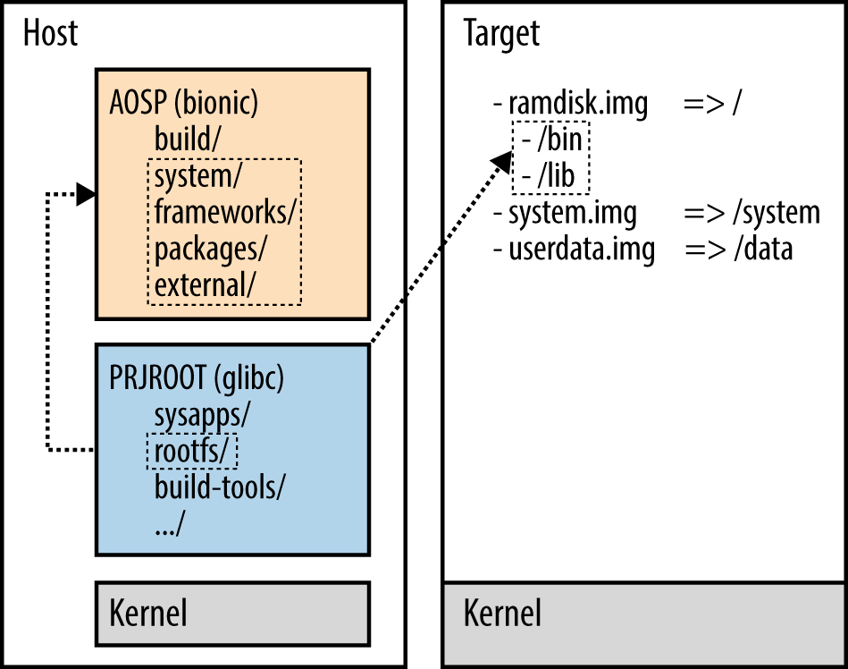
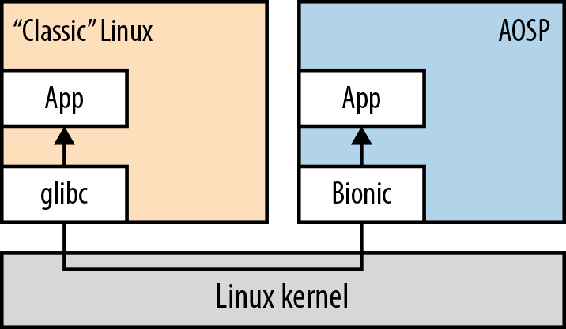
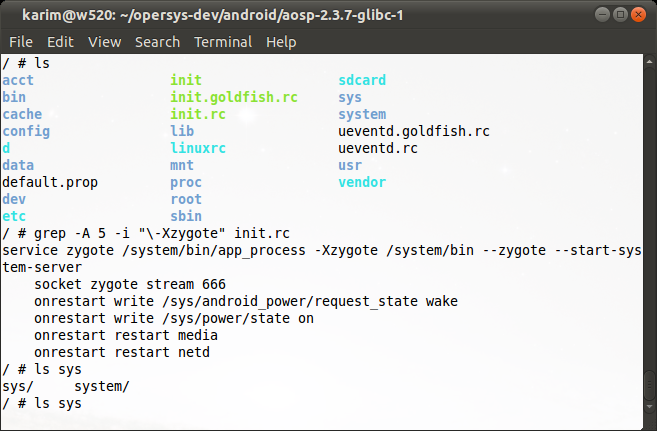
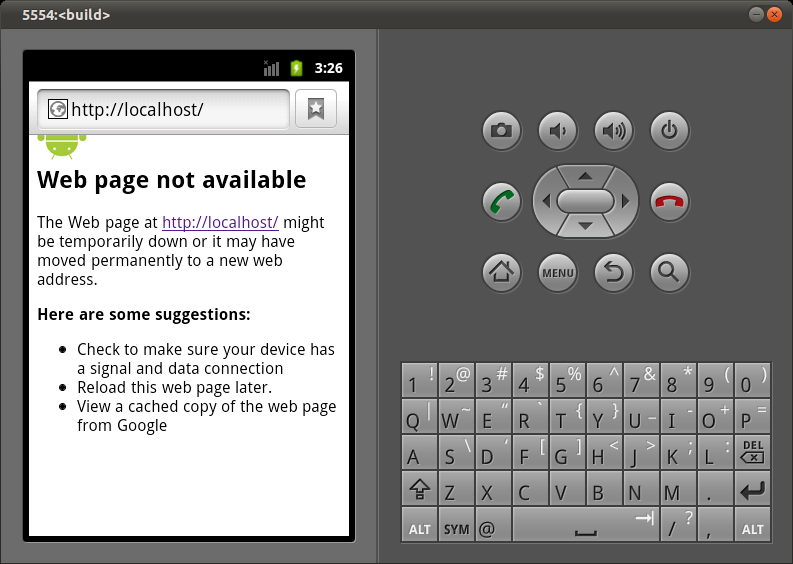
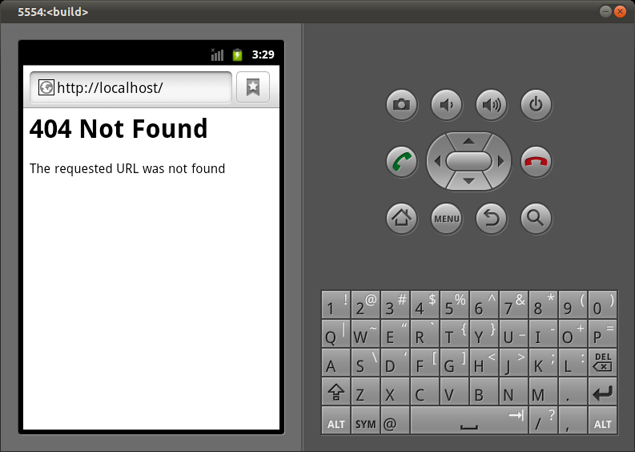

# 附录 A：遗留用户空间

正如我在第 2 章中解释的，尽管 Android 基于 Linux 内核，但它与其他任何 Linux 系统都几乎没有相似之处。正如你在图 2-1 中看到的，我们在第 6 章和第 7 章中探讨的 Android 用户空间是 Google 的定制创作。因此，如果你熟悉"传统"Linux 系统或来自嵌入式 Linux 背景，你可能会发现自己正在怀念长期以来一直在使用的经典 Linux 工具和组件。本附录将向你展示如何让传统 Linux 用户空间与 AOSP 在同一 Linux 内核之上共存。

## 基础

首先，我们需要就"传统"Linux 用户空间到底是什么达成一致。对于目前的讨论，我们假设我们讨论的是符合文件系统层次结构标准（FHS）的根文件系统。正如我之前提到的，Android 的根文件系统不符合 FHS，关键的是它不使用 `/bin` 和 `/lib` 等关键 FHS 目录，这使得我们可以将与 AOSP 并排的、确实使用这些目录的根文件系统叠加在其之上。

现在，我并不是说你能够使用这些说明来获得同时包含 AOSP 和比如说 Ubuntu 等大型发行版的根文件系统。关于 Ubuntu 作为一个发行版和 AOSP，你需要考虑的细节比解决根文件系统顶层目录的一些匹配问题多得多。然而，如果你熟悉如何为嵌入式 Linux 系统创建基本根文件系统，你应该会相当清楚如何让 BusyBox 和 glibc 等你最喜欢的工具和库与 AOSP 加载到同一根文件系统上。如果你对更雄心勃勃的事情感兴趣，例如让 Ubuntu 或 Fedora 与 AOSP 并排放在同一根文件系统中，这些解释提供了一个很好的入门介绍。

## 为什么费这个劲？

在开始这条路之前，值得回答一个关于这种方法的一般性问题：为什么要费这个劲？的确，为什么要花时间尝试让任何种类的传统 Linux 软件包与 AOSP 并排坐在同一内核上？为什么不直接使用 AOSP，因为它已经有 C 库、命令行工具、丰富的用户空间等等？难道 AOSP 不能做所有需要的事情吗？

开发者想要在 Android 旁边使用传统 Linux 用户空间的主要原因是，能够将现有的 Linux 应用程序移植到运行 Android 的系统上，而无需将它们移植到 Android。例如，如果你有在 glibc 上运行良好的遗留代码，直接让 glibc 进入你的根文件系统可能比尝试将遗留代码移植到 Bionic 更容易。事实上，正如你通过阅读 `bionic/libc/` 中 Bionic 自己的文档（尤其是 `docs/` 目录中的文件）可以看到的那样，与 glibc 等更主流的东西相比，Bionic 有许多局限性和差异。例如，它不符合 Posix，也不暴露 System V IPC 调用。通过依赖像 glibc 这样众所周知的 C 库，你可以避免所有这些可移植性问题。

重用经典 Linux 系统组件的另一个好理由是避免处理 Android 的构建系统。正如我们在第 4 章看到的，Android 的构建系统是非递归的。因此，如果你想重用大型遗留软件包，你通常需要将它们的构建系统转换为使用 Android 构建系统的 `.mk` 文件。事实上，导入到 AOSP `external/` 目录的一些非常知名的软件包的构建文件已经被重新创建以在 AOSP 内使用。例如，传统上基于 autoconf/automake 的 D-Bus，已经在其 `external/dbus/` 源码中添加了 `Android.mk` 文件，因此它可以在 AOSP 内构建。当它在 AOSP 内构建时，其原始构建使用的配置文件（如 configure 脚本）都没有被使用。解决这个问题的简单方法是，为你需要的那些遗留包独立于 AOSP 生成根文件系统，然后将结果与 AOSP 合并。

换句话说，重用现有遗留构建系统是有益的。例如，没有理由不使用 Yocto 或 Buildroot 之类的东西来生成符合你需求的根文件系统，然后将结果与 AOSP 合并。事实上，有许多现有的构建系统和打包系统可以使用遗留方法生成非常有用的输出与 AOSP 混合。在某些情况下，成本/收益分析可能使将一个软件包的构建系统移植到 AOSP 变得不可想象——仅仅是因为原始项目的代码库规模。

当然，目前的解释都不应该阻止你尝试针对 Bionic 构建你的遗留代码。所需更改的可能性很小。此外，正如我在第 4 章所示，你可以组合调用现有递归 make 构建脚本的 `Android.mk` 文件。

尽管如此，知道如何绕过 Bionic 是一个非常有用的技巧。所以我鼓励你继续阅读。

## 工作原理

一旦你决定要让传统 Linux 用户空间组件与 AOSP 一起工作，下一个问题就是如何做到。这实际上是一个两部分的问题。

首先，我们如何将遗留用户空间和 AOSP 放到同一文件系统镜像上？其次，这个遗留用户空间如何与 AOSP 的组件交互？让我们首先解决前者。

假设你使用嵌入式 Linux 系统构建（第 2 版）一书中涵盖的方法来生成基于 glibc 的根文件系统，图 A-1 说明了这种根文件系统如何与 AOSP 集成的总体方法。从本质上讲，项目环境 `PRJROOT` 被用于托管基于 glibc 的根文件系统的创建。然后修改 AOSP 构建系统，将该根文件系统内容复制到 AOSP 生成的镜像中。由于 AOSP 最初不包含 `/bin` 和 `/lib`，这些目录将由基于 glibc 的根文件系统内容创建并填充。

这些解释的其余部分假设你已经有了要与你 AOSP 合并的基于 glibc 的根文件系统，或者你知道如何创建一个。如果你没有也不知道如何创建一个，我建议你看看《构建嵌入式 Linux 系统》第 2 版（最初是我写的）。

一旦将遗留组件与 AOSP 合并的问题得到解决，另一个需要讨论的关键问题是，如何在这些组件内使用它们和/或与 AOSP 交互。简而言之，所有命令行工具和二进制文件都可以原样使用，直接从 Android 的命令行使用。例如，如果你有 `/bin/foo` 并且 `PATH` 包含 `/bin`，那么你可以直接运行它。

关于在基于不同 C 库构建的堆栈之间通信，更重要的一点是，需要在两者之间设置某种通信机制。典型的设置可能涉及使用套接字、共享内存、管道或 Android 中可用的其他 IPC 机制。

构建和合并

让我们更具体地了解如何实际构建和合并传统 Linux 用户空间。假设你已经有一个基于 glibc 的根文件系统你想要合并，或者你知道如何创建一个，你首先需要修改 AOSP 的 makefile 来合并你的传统根文件系统。

例如，假设你的 glibc 根文件系统位于 `$(PRJROOT)/rootfs-glibc`。你需要在 AOSP 的 makefile 中添加以下内容来合并它：

```
ALL_PREBUILT += $(GLIBC_ROOTFS)
$(shell mkdir -p $(TARGET_ROOT_OUT)/glibc)
$(shell cp -r $(GLIBC_ROOTFS)/* $(TARGET_ROOT_OUT)/glibc/)
```

这个 makefile 片段将 glibc 根文件系统内容复制到 AOSP 生成的根文件系统中的 `/glibc` 目录。

接下来，你需要确保你的 glibc 二进制文件可以从命令行访问。你可以通过两种方式做到这一点：要么将 `/glibc/bin` 添加到 `PATH` 环境变量中，要么将你需要的二进制文件符号链接到 AOSP 已有的一些目录中，如 `/system/bin`。

## 与 AOSP 组件通信

一旦你成功将传统用户空间与 AOSP 合并，下一个挑战是如何让传统组件与 AOSP 的组件进行通信。正如我之前提到的，所有命令行工具和二进制文件都可以原样使用。但如何让传统二进制文件与 Android 特定的组件进行交互呢？

图 A-2 展示了一个典型的设置，其中基于 glibc 的堆栈中的守护进程与 AOSP 组件进行通信。在这种情况下，glibc 守护进程和 AOSP 组件之间的通信通常通过套接字或 Android 的 Binder IPC 机制进行。

## BusyBox

BusyBox 是一个非常有用的工具，它可以与 AOSP 并排使用，以提供传统 Linux 工具的更全面实现。BusyBox 被设计为一个单一的二进制文件，包含许多常见 Unix 工具的实现，使其非常适合嵌入式系统。

将 BusyBox 与 AOSP 合并相对简单。你需要将 BusyBox 二进制文件构建为静态链接（这样它就不依赖于特定的 C 库版本），然后将其添加到你的根文件系统中。

一旦你有了 BusyBox，你就可以从命令行使用它提供的许多工具。图 A-3 显示了一个 BusyBox shell 会话的示例。

但 BusyBox 并不止于此。除了包含 vi 等命令（从而允许你直接在目标上编辑文件）之外，BusyBox 还包括一个 HTTP 服务器（httpd），你可以在 Android 设备上运行它。

图 A-4 显示了浏览器尝试连接到 localhost 时的情况——在典型 Android 设备上，你会得到类似的东西。然后你实际上可以像图 A-5 中看到的那样连接到它——404 消息。

作为一个一般规则，BusyBox 的命令集比 Toolbox 的要大得多。以下是 Toolbox 的命令集：

```
cat, chmod, chown, cmp, date, dd, df, dmesg, getevent, getprop, hd, id,
ifconfig, iftop, insmod, ioctl, ionice, kill, ln, log, ls, lsmod, lsof, mkdir,
mount, mv, nandread, netstat, newfs_msdos, notify
...
```

而以下是 BusyBox 提供的命令集的一小部分：

```
[, [[, addgroup, adduser, adjtimex, ar, arp, arping, ash, awk, basename, bunzip2,
busybox, bzcat, cal, cat, catv, chat, chattr, chcon, chgrp, chmod, chown, chpasswd,
chpst, chroot, chrt, chvt, cksum, clear, cmp, comm, cp, cpio, crond, crontab,
cryptpw, cut, date, dc, dd, deallocvt, delgroup, deluser, depmod, devmem, df,
dhttpd, diff, dirname, dmesg, dnsd, dnsdomainname, dos2unix, dpkg, dpkg-deb, du,
dumpkmap, dumpleases, echo, ed, egrep, eject, env, envdir, envuidgid, ether-wake,
expand, expr, fakeidentd, false, fbset, fbsplash, fdflush, fdformat, fdisk, fgconsole,
fgrep, find, fold, free, freeramdisk, fsck, fsck.minix, fsync, ftpd, ftpget, ftpput,
getenforce, getopt, getsebool, grep, groups, gunzip, gzip, halt, hd, hdparm, head,
hexdump, hostid, hostname, httpd, hwclock, id, ifconfig, ifdown, ifenslave, ifup,
inetd, init, insmod, install, ionice, ip, ipaddr, ipcalc, ipcrm, ipcs, iplink, iproute,
iprule, iptunnel, kbd_mode, kill, killall, killall5, last, length, linux32, linux64,
ln, loadkmap, loadfont, logname, losetup, lpq, lpr, ls, lsattr, lsmod, lspci, lsusb,
lzmacat, makedevs, man, md5sum, mdev, merge, microcom, mkdir, mke2fs, mkfs.ext2,
mkfs.minix, mknod, mkpasswd, mkswap, mktemp, modinfo, modprobe, more, mount,
mountpoint, msh, mt, mv, nameif, nc, netstat, nohup, nslookup, od, openvt, parse,
passwd, pgrep, pidof, ping, ping6, pipe_progress, pivot_root, pkill, popmaildir,
poweroff, powertop, printenv, printf, ps, pscan, pwd, raidautorun, rdate, rdev,
reboot, reformime, renice, reset, resize, rm, rmdir, rmmod, route, rpm, rpm2cpio,
rruntime, run-parts, runlevel, runsv, runsvdir, rx, script, sed, selinuxenabled,
sendmail, seq, setconsole, setfiles, setfont, setkeycodes, setlogcons, setsebool,
setsid, settime, sh, sha1sum, sha256sum, sha512sum, showkey, slay, sleep,软链接,
sort, split, start-stop-daemon, stat, strings, stty, su, sulogin, sum, sv, svlogd,
swapoff, swapon, switch_root, sync, sysctl, syslogd, tail, tar, tcpsvd, tee, telnet,
telnetd, test, tftp, tftpd, time, timeout, top, tr, traceroute, true, tty, ttysize,
tunctl, ubiattach, ubidetach, ubimkvol, ubirmvol, ubirsvol, ubiupdatevol, udhcpc,
udhcpd, udpsvd, umount, uname, uncompress, unexpand, uniq, unix2dos, unlzma,
unxz, unzip, uptime, usleep, uudecode, uuencode, vconfig, vi, vlock, volname, watch,
watchdog, wc, wget, which, who, whoami, xargs, yes, zcat, zcip
```

如你所见，BusyBox 提供了多得多的命令。

## 潜在问题

虽然将传统 Linux 用户空间与 AOSP 合并相对直接，但存在一些潜在问题你应该注意。

首先，你可能会遇到符号链接的问题。例如，在传统 Linux 系统中，`/etc` 是一个包含系统配置文件的目录。但在 Android 中，`/system/etc` 包含类似的配置信息。你可能需要将 `/system/etc` 中的内容符号链接到你传统根文件系统的 `/etc`。

其次，你可能会遇到命令输出的问题。例如，`ls` 的输出不是按字母顺序排列的，`grep` 等命令不可用。这是由于 AOSP 的 Toolbox 提供了这些命令的简化实现。

第三，你可能会遇到库依赖的问题。例如，glibc 和 Bionic 之间的差异可能导致某些二进制文件无法在 Android 上运行。在将任何二进制文件添加到你的根文件系统之前，你应该确保它们是静态链接的，或者你已经包含了所有必要的共享库。

尽管存在这些潜在问题，将传统 Linux 用户空间与 AOSP 合并仍然是一个有用的技巧，可以让你在 Android 设备上使用传统 Linux 工具和应用程序。

## 图片






