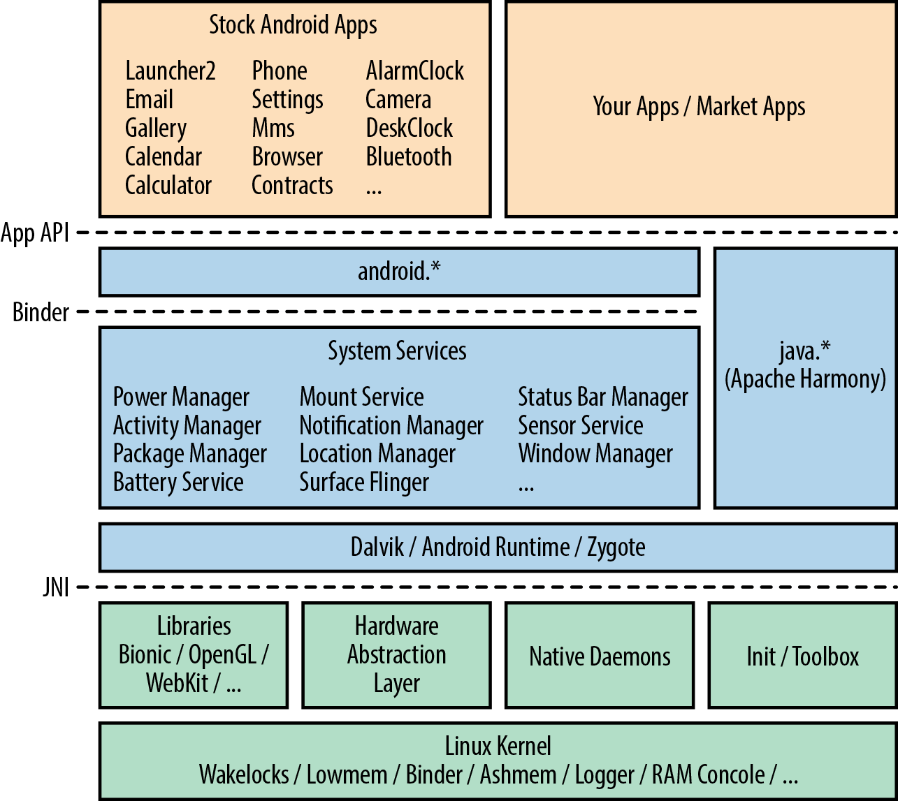

> 翻译：[Ross.Zeng](https://github.com/zengrx)
> 校对：

## 总体架构

图 2-1 可能是本书中最重要的图表，建议想办法记住它的位置——因为在后续章节中我们会经常直接或间接地引用它。虽然这是一个简化视图，但我们有机会在后续内容中逐步丰富它；它为 Android 的整体架构以及各组件如何协作提供了很好的概念。

如果你是 Linux 开发的熟悉者，第一件让你震惊的事应该是：除了 Linux 内核本身，这个技术栈中很少有 Linux 或 Unix 世界中常见的东西。没有 glibc、没有 X Window System、没有 GTK、没有 BusyBox、没有 bash shell，等等。许多资深 Linux 和嵌入式 Linux 从业者都注意到 Android 给人感觉非常"另类"。尽管 Android 栈从用户空间的干净起点开始，我们将在附录 A 中讨论如何让"遗留"或"经典" Linux 应用和工具与 Android 栈共存。

> **关于官方文档**：谷歌的开发者文档呈现的架构图与图 2-1 有所不同。那张图可能很适合应用开发者，但遗漏了嵌入式开发者必须理解的关键信息。例如，截至本书写作时，谷歌的图表和开发者文档几乎没有提到 System Server 和 Zygote——而这两个组件恰恰是 Android 架构的核心部分。

让我们深入 Android 架构的每个层次，从图 2-1 的底部开始向上研究。在处理完各组件之后，我们将通过概览系统启动过程来结束这一章节。
