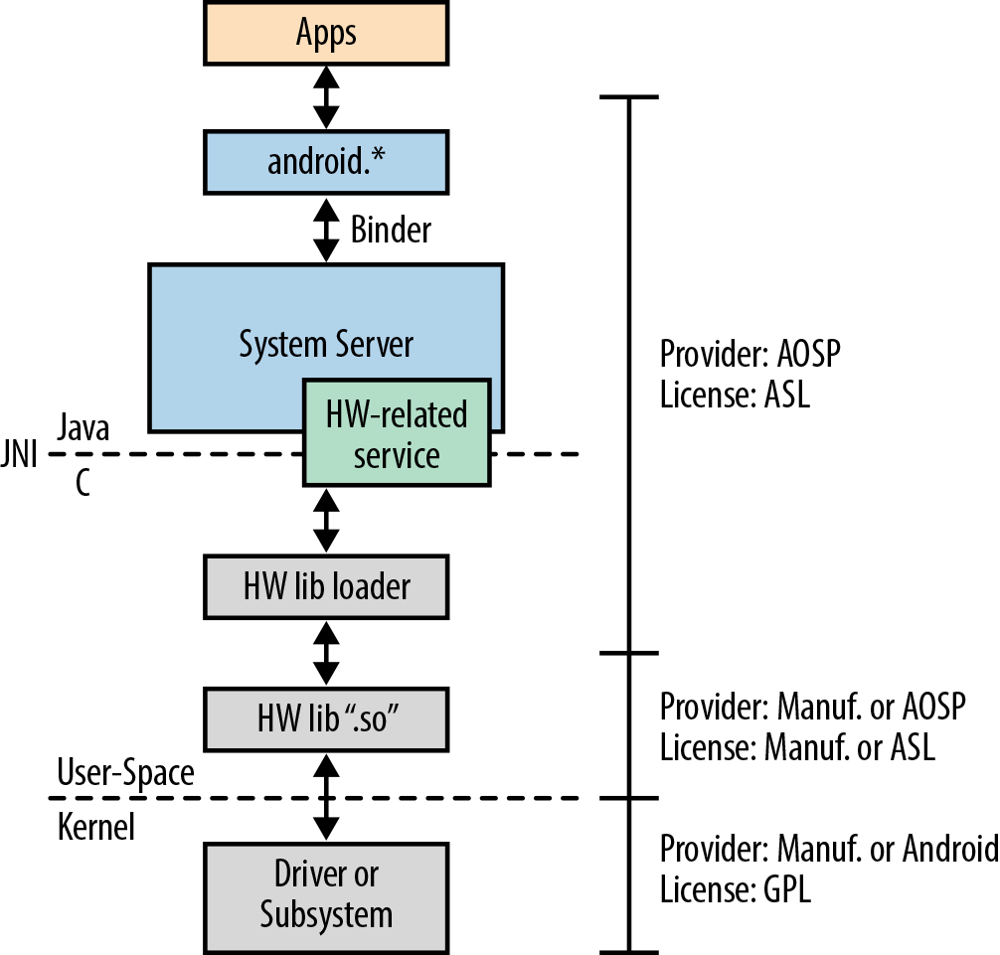

# 编译系统

上一章的目标是让你尽快上手 AOSP 开发。你完全可以就此合上这本书，直接开始修改你的 AOSP 代码树来满足你的需求。测试修改的方法也很简单——重新编译 AOSP、启动模拟器、必要时用 ADB 登录即可。不过，如果你想最大化开发效率，就需要对 Android 的编译系统有所了解。

尽管 Android 的编译系统是模块化的，但它的复杂度相当高，而且与主流编译系统截然不同——至少与大多数开源项目所用的编译系统不一样。具体来说，它以一种相当非传统的方式使用 make，且不提供任何基于 menuconfig 的配置界面（或类似方案）。

Android 有自己独特的编译范式，需要一些时间才能上手。所以——泡杯好咖啡，我们开始。

## 与其他编译系统的对比

在展开 Android 编译系统的细节之前，先让我强调一下它与你可能已知的编译系统有何不同。首先，与大多数基于 make 的编译系统不同，Android 的编译系统**不依赖递归 makefile**。以 Linux 内核为例，顶层 makefile 会递归调用各子目录的 makefile；而 Android 则不同——有一个脚本会遍历所有目录和子目录，直到找到 Android.mk 文件为止，之后就不再继续向下探索。此外，Android 不使用名为 Makefile 的文件，而是通过 **Android.mk** 文件来指定如何构建本地的"模块"。

> **注意**：Android 编译系统中的"模块"与内核"模块"完全不是一回事。在 Android 编译系统的语境下，"模块"是指 AOSP 中任何一个需要构建的组件。它可能是一个二进制文件、一个应用包、一个库等，也可能需要为目标或主机构建——但就编译系统而言，它们统一称为"模块"。

## 架构

如图 4-1 所示，理解 Android 编译系统的入口是 `build/core/` 目录下的 `main.mk` 文件——我们在上一章已经看到，它通过顶层 makefile 被调用。`build/core/` 目录实际上包含了编译系统的主体内容，后文将覆盖其中的关键文件。需要再次提醒的是：Android 的编译系统将所有内容聚合到**一个** makefile 中，它并不递归。因此，你看到的每个 .mk 文件最终都会成为包含整个系统构建规则的单一巨大 makefile 的一部分。



### 为什么 make 会"挂起"？

每次你输入 `make` 时，都会目睹一个看似恼人的构建现象：编译系统输出构建配置信息后，会在屏幕静止很长一段时间后才继续。在这段漫长的沉默之后，它才真正开始编译 AOSP 的各个部分，并像普通构建系统那样向屏幕输出常规信息。任何构建过 AOSP 的人都曾好奇：在这段时间里编译系统到底在做什么？答案是：它正在将 AOSP 中的所有 Android.mk 文件聚合到一起来。

如果你想亲眼看看这个过程，可以编辑 `build/core/main.mk`，将：

```makefile
include $(subdir_makefiles)
```

替换为：

```makefile
$(foreach subdir_makefile, $(subdir_makefiles), \
$(info Including $(subdir_makefile)) \
$(eval include $(subdir_makefile)) \
)
subdir_makefile :=
```

下次执行 `make -j16` 时，你就会看到实际发生了什么：

```
============================================
PLATFORM_VERSION_CODENAME=REL
PLATFORM_VERSION=2.3.4
TARGET_PRODUCT=generic
...
============================================
Including ./bionic/Android.mk
Including ./development/samples/Snake/Android.mk
Including ./libcore/Android.mk
...
```

### 配置

编译系统做的第一件事，是通过包含 `config.mk` 来引入编译配置。编译配置可以通过两种方式完成：使用 `envsetup.sh` 和 `lunch` 命令，或者在顶层目录提供 `buildspec.mk` 文件。两种方式都需要设置以下部分变量。

### envsetup.sh

`envsetup.sh` 脚本提供了一系列命令，用于配置和构建 AOSP。其核心是 `lunch` 命令，用于选择要构建的 Android 变体（flavor）和目标设备。

`envsetup.sh` 中包含的关键命令：

- **lunch**：选择要构建的产品。执行 `lunch <product_name>` 可以设置 `TARGET_PRODUCT`、`TARGET_BUILD_VARIANT` 等环境变量。
- **m**：从源码树根目录运行 make，等价于完整编译。
- **croot**：快速回到源码树根目录。
- **pid**：查看正在运行的模拟器或设备的 ADB PID。
- **grep**：在所有 Makefile 中搜索指定的 makefile 变量或目标。
- **get_build_var**：获取指定变量的值。
- **set_stuff_for_environment**：设置编译所需的环境变量。
- **set_sequence_number**：设置序列号（用于并行构建）。
- **add_lunch_combo**：向 lunch 菜单添加新的构建变体组合。

通过 `lunch` 设置的主要变量包括：

| 变量 | 说明 |
|------|------|
| `TARGET_PRODUCT` | 要构建的 Android 产品/设备型号 |
| `TARGET_BUILD_VARIANT` | 构建变体（如 `user`、`userdebug`、`eng`） |
| `TARGET_ARCH` | CPU 架构（如 `arm`、`x86`） |
| `TARGET_OS` | 操作系统（通常为 `linux`） |
| `TARGET_BUILD_TYPE` | 构建类型（如 `release`、`debug`） |
| `BUILD_SYSTEM` | 编译系统所在路径（通常为 `build/core`） |

执行 `lunch <product>` 后，这些变量被设置，后续的 `make` 命令会使用这些配置来决定构建哪些模块以及如何构建。

> `buildspec.mk` 的优先级高于 `envsetup.sh` 的设置。如果 `buildspec.mk` 存在于顶层目录，编译系统会首先读取其中的变量，覆盖通过 `lunch` 设置的值。

### 函数定义

由于 Android 的编译系统相当庞大——仅 `build/core/` 下就有超过 40 个 .mk 文件——为了尽可能复用代码，系统中定义了大量的函数和宏。这些函数定义分散在各个 .mk 文件中，其中最重要的定义位于 `definitions.mk`。

`definitions.mk` 中定义的常用函数包括：

- `my_dir`：返回当前 Android.mk 所在目录的路径。
- `all-java-files-under`：返回指定目录下所有的 Java 文件。
- `all-c-files-under`：返回指定目录下所有的 C 文件。
- `all-cpp-files-under`：返回指定目录下所有的 C++ 文件。
- `intermediates`：返回中间文件（.o、.dex 等）的输出目录。
- `gen`：生成文件的目录。
- `java_library`：构建 Java 库的标准模板。
- `shared_library`：构建共享库的标准模板。
- `static_library`：构建静态库的标准模板。
- `cc_binary`：构建 C/C++ 二进制可执行文件。
- `cc_library`：构建 C/C++ 库（可配置为静态或共享）。

这些函数通过 `include` 语句引入 Makefile，大幅简化了各个模块 Android.mk 的编写。

### 主要 Make 配方

你可能想知道各种产物（如 RAM disk 镜像、SDK 等）究竟是如何生成的。这些内容由 `main.mk` 中定义的主要构建目标控制。

核心构建目标：

- **droid**：默认目标，构建完整的 Android 系统镜像（相当于 `make droid`）。
- **sdk`：构建 Android SDK。
- **cts`：构建兼容性测试套件（CTS）。
- **ndk`：构建 Android 原生开发套件（NDK）。
- **clean`：清理构建输出（删除 `out/` 目录）。
- `clobber`：完全清理，包括删除所有构建产物。
- `modules`：仅构建所有模块，不生成系统镜像。
- `showcommands`：在构建时显示每个命令的详细输出。

### 清理

如前所述，`make clean` 等价于删除 `out/` 目录。clean 目标本身在 `main.mk` 中定义，但此外还有其他清理目标：

- `make clean`：删除 `out/target/product/<product>/` 下的所有内容。
- `make clobber`：删除整个 `out/` 目录，包括所有产品的构建产物。
- `make clean-<module>`：清理指定模块的构建产物。

### 模块构建模板

以上描述的是编译系统的架构及其核心组件的运行机制。读完这些，你应该对 Android 的构建过程有了更清晰的认识——接下来看看各个模块的 Android.mk 是如何组织的。

每个 Android.mk 文件通常包含以下部分：

```makefile
LOCAL_PATH := $(call my-dir)

include $(CLEAR_VARS)
LOCAL_MODULE := <模块名>
LOCAL_SRC_FILES := <源文件列表>
include $(BUILD_<TYPE>)
```

其中 `BUILD_<TYPE>` 可以是 `BUILD_SHARED_LIBRARY`、`BUILD_STATIC_LIBRARY`、`BUILD_EXECUTABLE` 等，对应编译系统提供的各种模块构建模板。

### 输出

了解了编译系统的工作原理和模块构建模板的使用方式后，来看看它在 `out/` 目录下创建了哪些产物。在较高层面，`out/` 目录的结构如下：

```
out/
├── target/
│   └── product/
│       └── <product>/
│           ├── system/          # 系统镜像内容
│           │   ├── app/         # 系统应用
│           │   ├── bin/         # 系统可执行文件
│           │   ├── lib/         # 系统库
│           │   └── etc/         # 系统配置文件
│           ├── root/            # 根文件系统
│           ├── ramdisk.img      # RAM disk 镜像
│           ├── system.img        # system 分区镜像
│           ├── userdata.img     # userdata 分区镜像
│           └── boot.img         # 启动镜像
├── host/
│   └── linux-x86/              # 为主机（Linux x86）构建的工具
│       └── bin/                # 主机端工具（如 aapt, dx, adb）
└── gen/                        # 生成的源代码（如 R.java, aidl）
```

构建产物按目标平台（target）和主机平台（host）分别组织。

## 编译配方

在了解了编译系统的架构和工作原理之后，接下来看一些最常用的，以及一些不太常见的编译配方。我们只会简要介绍每种配方的使用结果，但足以让你入门。

### 默认 droid 构建

前面我们用过不少简单的 make 命令，但还没有真正解释过默认目标。当你运行 `make` 时，实际上等同于输入了：

```bash
$ make droid
```

`droid` 是 `main.mk` 中定义的默认目标，通常不需要手动指定。这里列出它只是为了完整性。

### 查看编译命令

构建 AOSP 时，你可能注意到它实际上不会显示正在运行的具体命令，只输出每个步骤的摘要。如果想看它执行的全部操作（比如 gcc 的完整命令行），可以在命令行中加入 `showcommands` 目标：

```bash
$ make showcommands
...
host Java: apicheck (out/host/common/obj/JAVA_LIBRARIES/apicheck_intermediates/classes)
for f in ; do if [ ! -f $f ]; then echo Missing file $f; exit 1; fi; unzip -qo $f -d ...; done
javac -J-Xmx512M -target 1.5 ... -d out/host/common/obj/JAVA_LIBRARIES/apicheck_intermediates/classes ...
jar -cfm out/host/common/obj/JAVA_LIBRARIES/apicheck_intermediates/javalib.jar ...
Header: out/host/linux-x86/obj/include/libexpat/expat.h
cp -f external/expat/lib/expat.h out/host/linux-x86/obj/include/libexpat/expat.h
...
```

如上一节所说明的，这等同于：

```bash
$ make droid showcommands
```

使用 `showcommands` 时你很快会发现它会产生大量输出，难以跟踪。如果你想分析实际使用的编译命令，可以将标准输出和标准错误保存到文件：

```bash
$ make showcommands > aosp-build-stdout 2> aosp-build-stderr
```

也可以将所有输出合并到一个文件：

```bash
$ make showcommands 2>&1 | tee build.log
```

还有人喜欢用 `nohup`：

```bash
$ nohup make showcommands &
```

### 为 Linux 和 Mac OS 构建 SDK

官方 Android SDK 可从 http://developer.android.com 获取。但如果你扩展了核心 API 并希望向开发者分发新 SDK，也可以用 AOSP 自己构建：

```bash
$ . build/envsetup.sh
$ lunch sdk-eng
$ make sdk
```

构建完成后，SDK 位于 `out/host/linux-x86/sdk/`（Linux）或 `out/host/darwin-x86/sdk/`（Mac）。会有两份输出：一份是 ZIP 文件（与 http://developer.android.com 分发的类似），另一份是解压后可直接使用的版本。

假设你已按 http://developer.android.com 的说明配置好了 Eclipse 的 Android 开发环境，使用自建 SDK 还需要额外两步。首先，告诉 Eclipse 新 SDK 的位置：Window → Preferences → Android，在 SDK Location 框中输入新 SDK 路径，点击 OK。此外，还需要打开 Window → Android SDK Manager，取消选择所有已选项，仅保留 Tools 下的前两项，然后点击"Install 2 packages..."。完成这步后，就能用新 SDK 创建项目并访问其中的新 API 了。如果跳过第二步，可以创建新 Android 项目，但 Java 库无法正确解析，项目永远无法编译成功。

### 为 Windows 构建 SDK

Windows 上的 SDK 构建方法与 Linux 和 Mac 略有不同：

```bash
$ . build/envsetup.sh
$ lunch sdk-eng
$ make win_sdk
```

输出位于 `out/host/windows/sdk/`。

### 构建 CTS

构建兼容性测试套件（CTS）不需要使用 `envsetup.sh` 或 `lunch`，直接输入：

```bash
$ make cts
```

### 构建 NDK

NDK 的构建方法如下：

```bash
$ . build/envsetup.sh
$ lunch sdk-eng
$ make ndk
```

### 更新 API

在 AOSP 中更新 Android Framework API 需要谨慎，因为这会影响应用兼容性。API 的变更通过 `frameworks/base/api/*.xml` 文件记录，修改后需要运行：

```bash
$ make update-api
```

此命令会更新 API 声明文件，记录新增、移除或修改的 API。

### 构建单个模块

如果你只想构建某个特定模块，而不是整个系统，可以使用：

```bash
$ make <模块名>
```

模块名由 `LOCAL_MODULE` 指定。例如：

```bash
$ make libutils
$ make Settings
```

### 树外构建

AOSP 支持将模块的构建输出放到源码树之外。这在不想污染源码树或需要在不同环境中共享构建产物时很有用。通过设置 `OUT_DIR` 或使用 `dist` 目标：

```bash
$ make dist DIST_DIR=~/android-dist
```

这会将构建产物复制到指定目录。

## 基础 AOSP 技巧

你买这本书最大的目的可能就是——hack AOSP 来满足自己的需求。接下来几页中，我们会探讨一些你很可能最想尝试的常见技巧。当然，这里只是铺垫，主要涉及与编译系统相关的部分。

### 添加应用

为你的开发板添加一个应用相对直接。先创建一个存放应用源码的目录，例如在 `packages/apps/` 下新建一个目录，然后在其中创建 Android.mk 文件：

```bash
LOCAL_PATH := $(call my-dir)

include $(CLEAR_VARS)
LOCAL_MODULE := MyApp
LOCAL_SRC_FILES := $(call all-java-files-under, src)
include $(BUILD_PACKAGE)
```

构建时，执行 `make MyApp`，编译产物（.apk）会输出到 `out/target/product/<product>/system/app/`。

### 添加原生工具或守护进程

与上述添加应用的方式类似，也可以为开发板添加原生工具或守护进程。在 `external/` 或 `system/` 下创建对应的目录和 Android.mk：

```bash
LOCAL_PATH := $(call my-dir)

include $(CLEAR_VARS)
LOCAL_MODULE := my_tool
LOCAL_SRC_FILES := my_tool.c
include $(BUILD_EXECUTABLE)
```

守护进程还需要在 init 脚本中添加启动配置（init.rc）。

### 添加原生库

像应用和二进制文件一样，也可以为开发板添加原生库。创建 Android.mk 并使用相应的库模板：

```bash
LOCAL_PATH := $(call my-dir)

include $(CLEAR_VARS)
LOCAL_MODULE := libmylib
LOCAL_SRC_FILES := mylib.c
include $(BUILD_SHARED_LIBRARY)
```

使用 `make libmylib` 编译，库文件（.so）会输出到 `out/target/product/<product>/system/lib/`。

### 添加设备

添加自定义设备很可能是最高优先级的需求之一（如果不是排第一的话）。设备配置主要通过 `device/<vendor>/<device>/` 目录下的 BoardConfig.mk 文件完成，该文件指定：

- CPU 架构和变体
- 内核命令行参数
- 分区布局
- HAL 模块路径
- 产品特定配置

在 `device/<vendor>/<device>/` 下创建目录，添加 AndroidProducts.mk 和 BoardConfig.mk，然后在 `lunch` 菜单中选择对应的产品即可。

### 添加应用覆盖层

应用覆盖层（App Overlay）用于在不修改原始应用源码的情况下替换应用资源（图片、字符串、布局等）。在 `vendor/<vendor>/overlay/` 下创建对应应用名称的目录结构，按照标准 Android 资源组织方式放置替换文件即可。编译系统会自动将覆盖层资源优先于默认资源编译进最终镜像。
