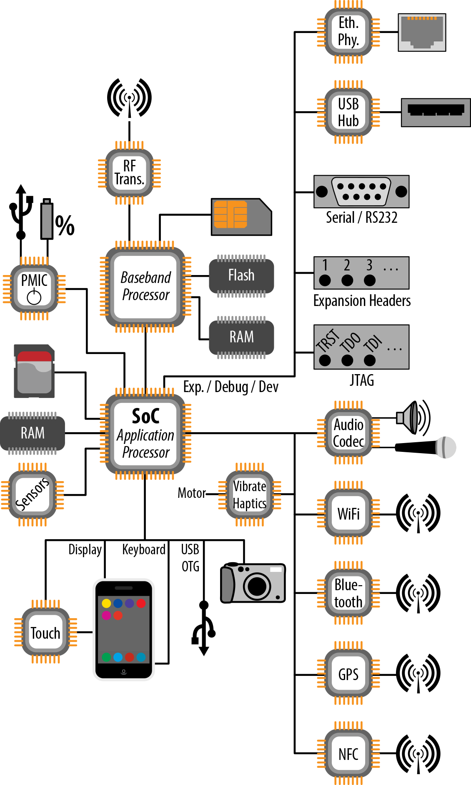
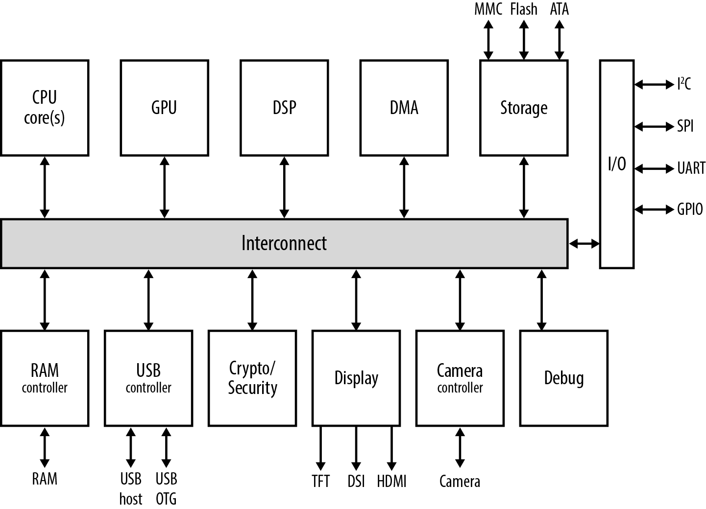

# 典型系统架构

正如第 1 章所讨论的，Android 应该可以在任何运行 Linux 的硬件上运行。然而，Android 并非在真空中构建的。它最初是为手机设计的，其当前架构仍然反映了这一点。图 5-1 展示了一个用于运行 Android 的典型嵌入式系统的架构框图。你的实际目标很可能与我展示的大不相同——可能差异很大。但为了便于讨论，这个图应该足够说明问题了。

最重要需要注意的是，系统的核心是一个 SoC。我们将在下一节更详细地讨论 SoC。现在只需知道：一个 SoC 包含一个 CPU 和大量外设控制器，它们都在同一块集成电路（IC）芯片上。目标板上所有其他组件通常都以某种方式连接到 SoC。Android 本质上运行在这个 SoC 上，并从这一点控制和/或访问板上的所有东西。

### 基带处理器

下一个需要关注的组件是基带处理器。市场上大多数手机都有独立的处理单元，分别用于运行用户界面软件和管理无线电功能。这些通常被称为应用处理器（AP）和基带处理器（BP）。

你可能想知道为什么有两个独立的处理器而不是只有一个。原因既有法律方面的，也有技术方面的。首先，在美国，法律要求软件定义无线电（SDR）设备必须获得联邦通信委员会（FCC）的认证。认证的一部分要求是：控制无线电的软件未经授权不得修改。本质上，这意味着在任何情况下都不应允许设备的最终用户更改无线电的运行方式或使用的频率。此外，无线电功能的运行有严格的实时约束。因此，从运行用户界面的同一 CPU 控制无线电是不可行的。在 AP 睡眠时 BP 继续运行也是有好处的。

基带处理器和应用处理器之间的交互是理解 Android 的 RIL 架构与底层硬件紧密耦合的关键。在一个非常简单的层面上，BP 和 AP 通过某种形式的串行总线使用 AT 命令相互通信。注意 BP 有自己的 Flash 和 RAM。这保证了运行在 BP 上的认证软件与运行在 AP 上的软件隔离开来，而且运行在 BP 上的实时操作系统（RTOS）专注于运行一件事：无线电操作。例如，BP 运行实现 GSM 协议栈的软件。还要注意 SIM 卡和射频收发器连接到 BP。收发器负责与基站进行实际的射频发射和接收，而 SIM 卡用于向移动网络运营商（MNO）识别手机用户。

### 核心组件

虽然我们将要讨论的许多组件在你的嵌入式系统中可能存在也可能不存在，但有几个组件在任何嵌入式系统中（无论是 Android 还是其他）几乎是肯定会存在的：RAM 和存储。RAM 没什么好说的，但存储可能有不同的形态。

传统上，大多数嵌入式系统会配备 NOR 或 NAND Flash，并使用 Flash 文件系统来管理这些芯片并实现磨损均衡。然而，最近的趋势是转向嵌入式多媒体卡（eMMC）芯片。从本质上讲，这些芯片表现为 SD 卡，由 Linux 内核作为传统块设备管理（即与传统 ATA 硬盘相同的方式）。因此，这些系统没有任何 NOR 或 NAND Flash，只有一个 eMMC 芯片。它们的 SoC 芯片有执行基本读取和直接从 eMMC 上的分区启动所需的模块。

此外，系统上可能连接了多个存储设备。Android 实际上区分"内部"和"外部"存储。"内部"存储通常指定板载 eMMC，而"外部"存储则指定连接到手机或平板电脑的可由用户移除的 SD 卡。前者承载 Android 本身，用于启动和常规文件系统操作。后者存储图片和其他多媒体内容。当然，如果你的设备不是手机或平板电脑，这种区别对你没什么用处，但 Android 应用开发 API 反映了 Android 的手机血统，对这两种存储做了区分。

### 电源管理 IC

在任何电池供电设备中，你都可能找到的另一个组件是电源管理 IC（PMIC）。PMIC 的工作是管理电池的各个方面，包括调节它提供的电压和控制充电。PMIC 通常连接到电池和用于给板供电的任何直流电源。在大多数消费设备上，外部直流电源来自 USB On-the-Go（OTG）接口，它同时作为电源充电器的插头。在非移动设备的情况下（甚至某些移动设备也是如此），外部电源不是通过 USB 提供的，而是通过其他类型的连接器（如筒形连接器）提供的。

PMIC 通过 SPI、I2C 和/或 GPIO 连接到 SoC。它可以产生中断来处理低电量或充电器连接等情况。它还可以（越来越多地）包含除电源管理以外的功能。例如，它可能包含实时时钟（RTC）、音频编解码器和 USB 收发器。

### 现实世界交互

Android 当然主要是一个面向用户的系统。正如其兼容性定义文档（CDD）所建议的，基于它构建的系统应该允许丰富的用户交互，并包含相当多的硬件组件来接入用户的直接物理环境。这反过来意味着有相当多的硬件组件专门用于此任务。

首先，是与直接用户交互相关的部件，如显示器、触摸输入和键盘。虽然手机通常直接使用 SoC 的集成显示功能，但具有较大显示屏的设备（如平板电脑）通常会有用于低压差分信号（LVDS）驱动 LCD 显示器的显示桥接器。还有一个触摸控制器用于处理屏幕触摸传感器，以及一些用于处理键盘或设备上任何物理按钮的电路。

其次，有些部件允许用户与周围世界交互。这包括相机（或多个相机——例如，有些设备有前置和后置摄像头，用于视频聊天）等，由 SoC 控制，还有音频输入/输出，由音频编解码器 IC 控制。但硬件还包括用于感知设备直接环境物理特性的各种传感器和机械交互的组件。

例如，各种传感器可能在 Android 设备中找到，如加速度计、陀螺仪、温度计、气压计、光度计、磁力计和接近传感器。为了简化图表，我只画了一个"传感器"IC，但实际上板上可以有许多传感器 IC。还有用于产生振动和/或向用户提供触觉反馈的组件。同样，可能涉及多个组件。

### 连接性

Android 的特性之一是它的连接性，运行它所需的硬件配备了各种标准的控制器、连接器和天线，如 USB、WiFi、蓝牙、GPS 和 NFC。同样，这些越来越倾向于被封装在一起，而不是作为独立的 IC。

大多数市场上的消费 Android 设备只提供一个 USB OTG 接口，用于将设备连接到电脑或插入另一个 USB 设备，如相机或 U 盘。只有极少数设备也允许将 USB OTG 接口用作 USB 主机。更少的设备提供独立的 USB 主机接口来连接外设，就像你通常连接到 PC 或 Mac 的 USB 主机那样。

### 扩展、开发和调试

除了我们刚刚介绍的主流 Android 设备中的典型组件外，SoC 通常还可以容纳大量其他组件和外设。虽然其中大多数在消费手机或平板电脑上找不到，但它们绝对可以用于其他基于 Android 的嵌入式系统。有些或多或少得到了 Android 栈的良好支持，而有些则完全没有。但这正是让你进入嵌入式开发的原因，不是吗？去大胆探索其他开发者不敢去的地方？

因此，你会很容易找到配备以太网、USB 主机、串行（RS-232）、JTAG 和扩展头等组件和连接器的开发板。例如，流行的 BeagleBoard 和 PandaBoard 就有其中大部分。JTAG 是一个硬件级调试接口，因此不需要来自 Linux 内核或 Android 栈的任何软件支持。开发板暴露的扩展头通常允许将外设板（即通过扩展头连接的在扩展头上的附加模块）连接到 SoC 的某些引脚，如 I2C 或 GPIO。然后你就需要确保加载适当的设备驱动程序，使 Linux 能够与附加模块上的外设通信。

串行端口连接由 Linux 内核的 TTY 层提供。只要你的内核对 SoC 有串行控制台支持（如果 Linux 在你的 SoC 上运行，通常会有），这应该几乎可以"开箱即用"地工作。串行端口连接对嵌入式系统至关重要，尤其是在板启动期间，因为它是主机和目标之间通信的一种简单而有效的方式。

USB 主机模式如果你使用的是 Android 3.1 或更高版本就可以工作。早期的版本（包括 Gingerbread）在 Android 栈中没有 USB 主机模式支持。但这不妨碍底层 Linux 内核默认支持相同的 USB 设备集。只是意味着从 Android 3.1 开始可用的 USB 主机模式的应用 API 对你不可用。

### 向 Android 添加以太网支持

Android 目前默认不能正确处理以太网，但这并没有阻止需要以太网的人实现它。

### 片上系统（SoC）内部有什么？

到目前为止，我们把 SoC 作为一个黑盒子来讨论。让我们深入看一下，了解典型 SoC 的内部情况。图 5-2 展示了一个典型 SoC 的内部结构。

正如你所看到的，远不止 CPU 核心。SoC 在某种程度上它自己的电路板，通过总线互联将各种不同的组件（通常称为"互联结构"）互联。每个组件的数量和复杂性取决于 SoC 及其制造商。虽然市场上大多数 SoC 都包含一组相似的可互换的基本组件，但这里没有真正的标准。就像前面介绍的系统架构框图一样，这些组件中的许多可能被组合在一起，或者被进一步分成额外的模块。这毕竟只是一个简化视图。还要注意的是，SoC 内的并非所有组件都以相同的时钟速度运行。例如，虽然 CPU 可能被列为接近或高于千兆赫兹的时钟速度，但图形处理单元（GPU）可能仅以几百兆赫兹运行。

GPU 通常有时钟速度，是从 CPU 自身的速度分频下来的。例如，如果 CPU 以 1GHz 时钟，GPU 可能以 250MHz 运行。虽然它们运行较慢，但 GPU 是由大规模并行计算单元组成的。即使 CPU 是双核的，GPU 也可能有 16 或 64 个核心。

**表 5-1. SoC 阵容**

| SoC | 制造商 | CPU | 速度 | GPU |
|-----|--------|-----|------|-----|
| OMAP3 | Texas Instruments (TI) | ARM Cortex-A8 | 600MHz−1.2GHz | PowerVR SGX530 |
| OMAP4 | TI | 双核 ARM Cortex-A9 | 1−1.8GHz | PowerVR SGX54x |
| OMAP5 | TI | 双核 ARM Cortex-A15 | 2GHz | PowerVR SGX544 |
| i.MX51 | Freescale | Cortex-A8 | 800MHz | OpenGL ES 2.0 兼容 |
| i.MX53 | Freescale | Cortex-A8 | 1GHz | OpenGL ES 2.0 兼容 |
| i.MX6 | Freescale | 双核或四核 Cortex-A9 | 1GHz | OpenGL ES 2.0 兼容 |
| Tegra 2 | Nvidia | 双核 ARM Cortex-A9 | 1−1.2GHz | GeForce |
| Tegra 3 | Nvidia | 四核 ARM Cortex-A9 | 1.3GHz | GeForce |
| Snapdragon S2 | Qualcomm | Scorpion | 800MHz−1.5GHz | Adreno 205 |
| Snapdragon S3 | Qualcomm | 双核 Scorpion | 1.2−1.5GHz | Adreno 220 |
| Snapdragon S4 | Qualcomm | 双核 Krait | 1−1.7GHz | Adreno 225 或 320 |
| Exynos | Samsung | 单核或双核 ARM Cortex-A8 | 1−1.5GHz | PowerVR SGX540 或 ARM MALI-400 |
| Exynos 4 | Samsung | 四核 Cortex-A9 | 1.4−1.6GHz | ARM MALI-400 MP4 |
| Exynos 5 | Samsung | 四核 Cortex-A15 | 2.0GHz | ARM MALI-T658 |
| Atom | Intel | 单核 x86 | 1.6−2GHz | PowerVR SGX540 |
| MT6575 | Mediatek | Cortex-A9 | 1GHz | PowerVR Series5 SGX |
| MT6577 | Mediatek | 双核 Cortex-A9 | 1GHz | PowerVR Series5 SGX |

传统上，Android 与基于 ARM 的 SoC 一起使用，这一点在上表中得到了很好的反映。但正如我们之前看到的，它已被实现在 Linux 支持的各种其他架构上，如 x86、MIPS、SuperH 和 PowerPC。事实上，摩托罗拉和联想等公司的许多设备已经使用英特尔芯片发货。Google 和 Intel 合作将 x86 支持引入上游 AOSP。

SoC 中的另一个重要组件是 GPU，负责加速图形渲染到设备显示器。虽然 Android SoC 的大多数 CPU 核心是基于 ARM 的，但没有所有 SoC 制造商使用的标准 GPU。相反，每个制造商使用不同的 GPU，如你在表 5-1 中所见的。

除了 CPU 和 GPU 之外，SoC 中大多数其他组件的作用可以更简单地描述：

- **RAM 控制器**：与板载 RAM 接口。
- **DMA**：处理 RAM 和内存映射硬件之间数据的自动传输。
- **USB 控制器**：管理设备 USB 连接的硬件端。
- **DSP**：为某些信号处理（如 JPEG 编码）提供硬件加速。
- **显示**：使 SoC 能够驱动各种显示类型。
- **相机**：使 SoC 能够与相机接口。
- **存储**：管理与可用于 SoC 的各种存储类型的 I/O。
- **调试**：通过各种机制（如 JTAG）将 SoC 连接到硬件调试工具。

SoC 还可能包含一些加密和安全功能。这可能简单地由通用加密函数的硬件加速组成。它还可能包括 SoC 制造商向设备制造商提供的安全机制，用于锁定设备和防止未经授权的代码运行。此类机制通常用于实施数字版权管理（DRM），可能会让想要重新编程设备的人感到沮丧。

最后，SoC 最有可能具有使用各种不同总线和接口连接额外外部 IC 的能力。这就是例如前面章节描述的大多数组件通过 PCB 上的布线连接到 SoC 的方式。此类总线和接口可能包括 I2C、SPI、UART 和 GPIO，但也可能包括其他机制。
