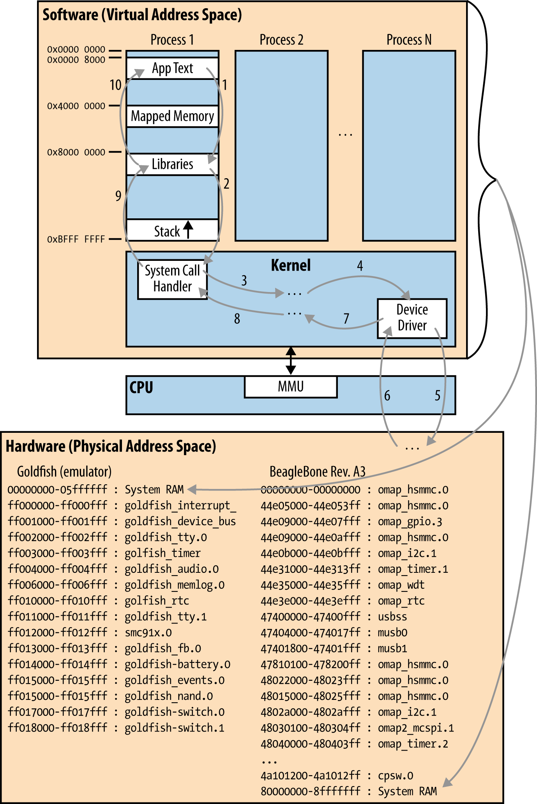

# 内存布局和映射

为了有任何用处，我们刚才看到的硬件组件必须以某种方式从软件访问。一般来说，这是通过 Linux 内核中的设备驱动程序完成的。应用程序然后使用这些驱动程序暴露的标准接口来与底层硬件通信。图 5-3 说明了这是如何工作的。

连接到任何 CPU 的其中一条总线是地址总线。这条总线被连接起来以允许 CPU 使用独立的地址范围访问所连接的组件。实际上，大多数组件占据多个（通常是连续的）地址区域。CPU 通过其地址总线可访问的地址通常称为物理地址，意味着它们代表连接到 CPU 的真实物理组件。

物理地址空间中每个组件的实际位置通常称为物理地址映射，由设备设计者在将 SoC 与 PCB 上包含的各种组件的连接布线时确定。

如果你想在运行时查看内核看到的物理内存映射，你只需进入命令行输入 `cat /proc/iomem`。该映射可能不包含你实际板上的所有外设，但会包含内核看到的那些。

应用程序和设备之间的映射之所以有效，是因为 CPU 通过其内存管理单元（MMU）管理两个完全独立的地址空间。使用其 MMU，CPU 可以向运行在它上面的应用程序呈现虚拟地址空间，同时仍使用物理地址空间与通过其地址总线连接的组件通信。

驻留在物理地址空间中的组件之一是系统 RAM。应用程序的"文本"（即应用程序的代码）位于虚拟地址空间的非常接近开头的地方。它后面是映射的内存区域。这些是虚拟地址，指向与其他进程共享用于进程间通信的 RAM，或使用相应驱动程序的 mmap() 函数映射到进程地址空间的物理地址范围。

物理地址范围到进程地址空间的映射允许进程直接驱动 IC 组件或其他连接设备，而不必为每个操作都通过内核和设备的驱动程序。这对于图形渲染等性能密集型操作特别有用。然而，它也是在内核之外导出关键设备驱动程序智能的有效手段，因此从内核的 GPL 要求中减去它。实际上，它是在 Android HAL 组件中实现关键驱动程序功能的非常有效的手段。

最后，库从 0x8000 0000 开始，进程的栈从进程最高地址向下增长。
