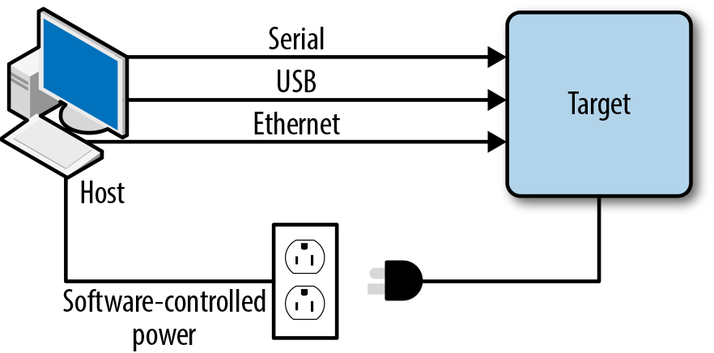
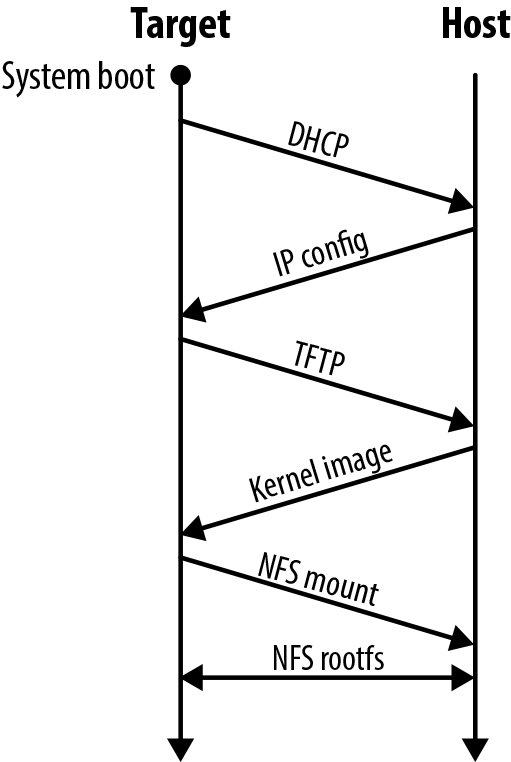

# 开发设置

一旦你有了一些原型硬件，并在整个板启动和开发过程中，将目标连接到开发工作站是非常实用的。图 5-4 展示了一个典型的主机-目标调试设置。你的具体连接可能不同，但这个设置代表理想情况。

主机和目标之间的连接可以服务于各种有时重叠的目的。通过将目标的电源连接到由主机管理的软件控制电源，可以对板的加电/断电进行脚本化，从而用于自动化测试各种软件版本。

经典的目标连接到其主机的方式是通过串行连接，通常是 RS-232。这通常允许你与板的引导程序交互、上传和下载小文件，并在其他什么都无法工作的情况下与目标进行基本交互。

以太网连接将允许主机向目标提供各种服务（如图 5-5 所示）。例如，为了简化迭代调试过程，最好让目标使用 DHCP 检索其 IP 配置，使用 TFTP 加载其内核镜像，并通过 NFS 挂载其根文件系统。如果你这样做，你在主机上对项目所做的任何更改将在重启时部署到目标。

最后，尤其是在 Android 的情况下，USB 非常有用。确实，使用 Android 你可以依靠 USB 通过 ADB 连接到目标，就像应用开发者连接到消费手机或平板电脑进行应用开发一样。所有典型的 ADB 命令都可以使用，包括登录目标、转发端口、更新文件系统等。

你的具体设置很可能有自己的特点，但这里显示的配置应该给你一个总体目标概念。
