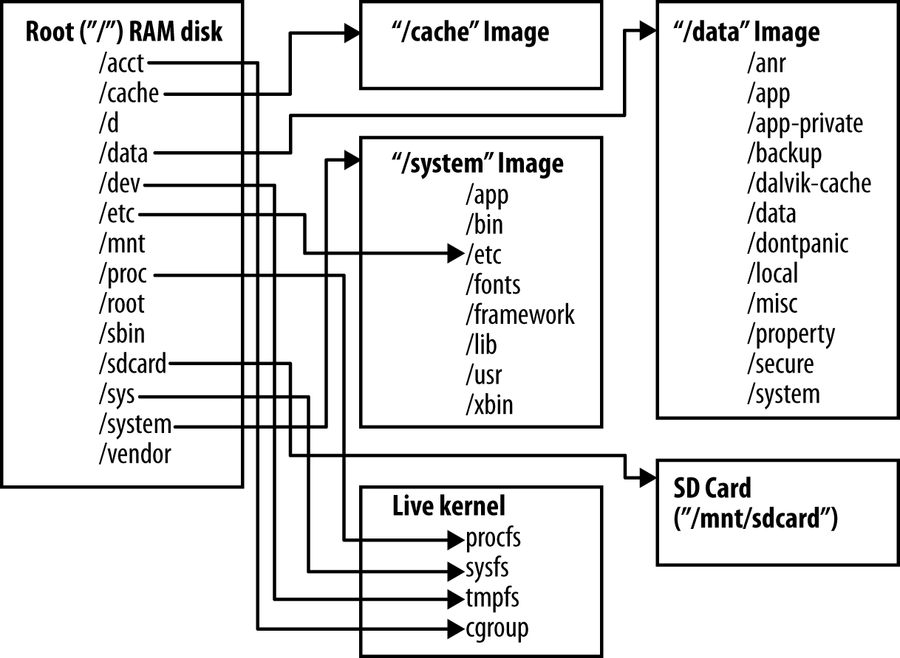
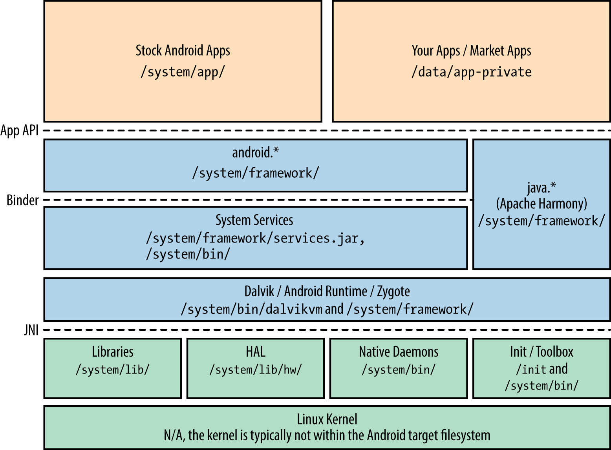
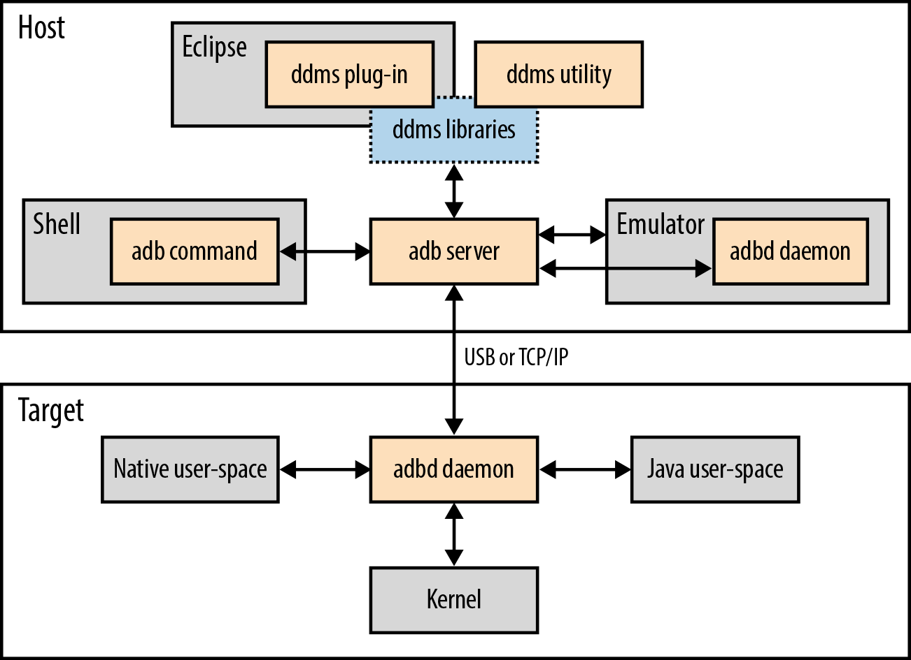
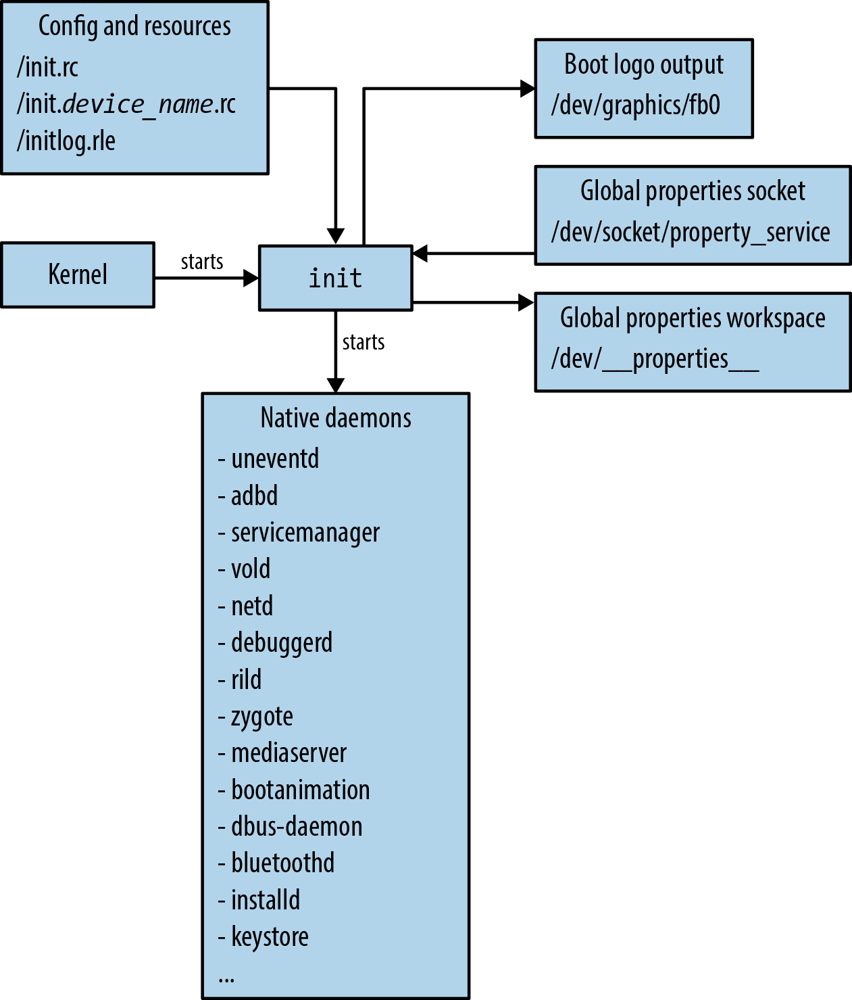
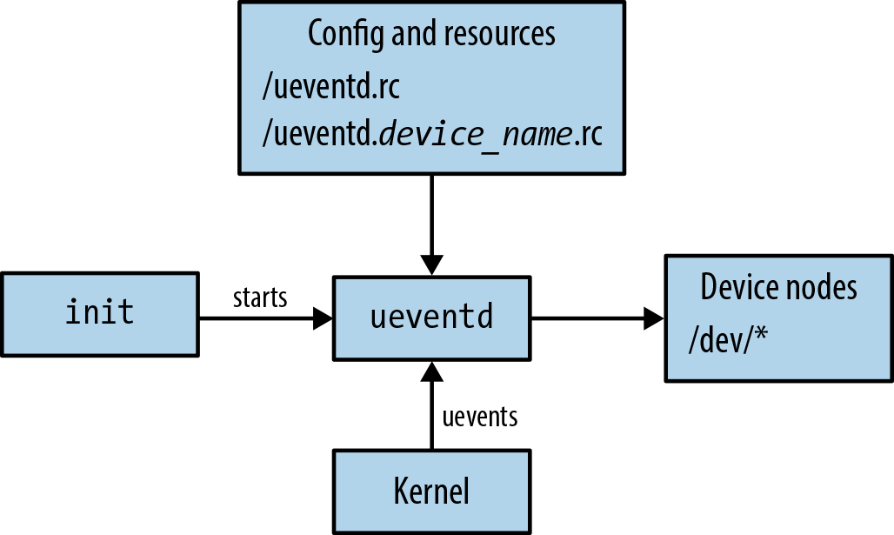

# 原生用户空间

到了这一步，你可能已经亲自动手尝试过一些东西，也可能非常渴望在真实的 Android 系统上练练手。和任何嵌入式系统的开发一样，你的典型目标通常是先让系统达到最小可运行状态，然后逐步添加对更多硬件和功能的支持，直到满足你的需求。

显然，要让 Android 系统达到最小可运行状态，首先需要在你的主板上启动内核。正如前面提到的，获得兼容 Android 的内核的最佳途径是联系你的 SoC 供应商——内核移植和主板启动已经超出了本书的范围。但一旦你有了最小可运行的内核，你需要处理的第一个 Android 组件就是它的原生用户空间。

正如第 2 章所述，这一基础层是 Android 栈所有上层组件的宿主环境，包括 Dalvik 虚拟机及其上运行的服务和应用。同时，Android 硬件支持的部分实现也在这里。因此，现在是仔细审视 Android 原生用户环境的最佳时机。首先，它与大多数经典嵌入式 Linux 系统的内容存在显著差异，值得单独讨论。

## 文件系统

第 4 章我们讨论了编译系统如何运作以及它生成什么。具体来说，表 4-3 提供了编译系统生成镜像的详细列表。而图 6-1 则展示了这些镜像在运行时的相互关系。除少数例外情况（将在后面介绍），这个文件系统布局在 2.3/Gingerbread 和 4.2/Jelly Bean 中基本相同。

要理解从编译系统生成的镜像到图 6-1 所示运行时配置的过程，需要回到第 2 章的系统启动说明，更具体地说是回看图 2-6 所示的启动流程。本质上，内核将编译系统生成的 RAM disk 镜像挂载为根文件系统，并启动该镜像中的 init 进程。init 进程的配置文件（将在本章后面介绍）会导致多个额外的镜像和虚拟文件系统被挂载到根文件系统中现有目录项上。



你可能会问的第一个问题是："为什么需要这么多文件系统？"答案是：每个镜像有不同的用途，对应的存储设备或技术也各有不同。例如，RAM disk 镜像应尽可能小，它的唯一目的是提供使系统启动所需的初始骨架。它通常以压缩镜像的形式存储在某种介质上，由内核加载到 RAM 中，然后以只读方式挂载为根文件系统。

而 `/cache`、`/data` 和 `/system` 通常从实际存储介质的独立分区挂载。通常 `/cache` 和 `/data` 以读写方式挂载，而 `/system` 以只读方式挂载。

### 使用单一文件系统

实际上，你完全可以使用单一文件系统来存储 Android 所有编译输出，而不必使用独立的存储分区。德州仪器的 RowBoat 发行版就是这样做的。它生成单一的根文件系统镜像，直接编程到目标存储设备上使用。以 BeagleBone 或 BeagleBoard为例，根文件系统的全部内容被编程到 microSD 卡的单个分区中，用于启动和作为设备的主存储。

然而，通过合并为单一文件系统，意味着你假设可以一次性更新整个文件系统。总之，这将很难为系统创建安全的更新程序。在 RowBoat 对 Beagle 系列的支持中，这可能不是问题，因为它们是开发板，但在你的实际产品中，这很可能会成为问题。

在 Android 2.2 及更早版本中，这三个目录通常都从 YAFFS2 格式化的 NAND flash 分区挂载。由于手机制造商已逐步转向 eMMC 而非 NAND flash， YAFFS2 在 Google 的 Android 2.3 首发设备三星 Nexus S 中被 ext4 取代。此后，所有基于 Android 的手机都应使用 ext4 而非 YAFFS2。不过，你完全可以选择使用其他文件系统类型——只需修改编译系统的 makefile 来生成这些镜像，并更新 init 配置文件中的 mount 命令参数。

### eMMC 与 NOR 或 NAND Flash

正如《构建嵌入式 Linux 系统》第 2 版所述，Linux 的 MTD 层用于在 Linux 中管理、操控和访问 flash 设备，包括 NOR 和 NAND flash。在此之上会使用各种文件系统（如 JFFS2、UBIFS 或 YAFFS2），使 flash 设备或分区成为 Linux 虚拟文件系统（VFS）的一部分。这些 flash 文件系统通常实现磨损均衡和坏块管理，以正确处理底层 flash 设备。

eMMC 设备（如第 5 章所述）表现为传统的块设备。本质上，它包含一个微控制器和一些 RAM，能够透明地完成磨损均衡和坏块管理。因此，操作系统可以使用普通的磁盘文件系统如 ext4。据 Android 开发者 Brian Swetland 称，转向 eMMC 的决定是由 PCB 上减少引脚数量从而降低成本驱动的——但使用这种设备还有一些额外的好处。

首先，它允许你使用与传统 Linux 文件系统相同的所有传统命令和方法。MTD 子系统虽然强大，但需要一段时间才能熟练使用。此外，flash 文件系统通常为单处理器系统设计，而 Linux 中的磁盘文件系统长期以来需要应对多处理器系统。因此，它们可能更适合即将到来的多核 Android 设备潮流。

SD 卡始终表现为块设备，通常在其上创建 VFAT 文件系统。这是可以预期的，因为用户需要能够将 SD 卡从 Android 设备上取出并插入普通电脑（无论运行什么操作系统）。`/proc`、`/sys` 和 `/acct` 分别通过 procfs、sysfs 和 cgroupfs 挂载。虽然 `/proc` 和 `/sys` 的挂载位置与传统 Linux 系统相同，但 cgroups 在传统 Linux 中通常挂载为 `/cgroup`，而在 Android 中挂载为 `/acct`。还要注意 `/dev` 以 tmpfs 方式挂载，这意味着它的内容是动态创建的，不驻留在任何永久存储上。这没有问题，因为 Android 依赖 Linux 的 udev 机制来动态创建设备节点——当设备插入和/或驱动程序加载或初始化时。

Procfs、sysfs、tmpfs 和 cgroupfs 都是由当前运行内核在系统中维护的虚拟文件系统。它们没有任何对应的存储，实际上是内核内部维护的数据结构。Procfs 是内核向用户空间导出信息的传统方式。通常，procfs 中的条目被视为文本文件，或包含文本文件的目录，可以转储到命令行以从内核提取特定信息。例如，如果你想知道系统运行的 CPU 类型，可以转储 `/proc/cpuinfo` 文件的内容。

随着内核成熟和需求增长，人们逐渐认为 procfs 并不一定是所有内核与用户空间之间接口的正确机制。于是 sysfs 出现了，它与内核的设备和硬件管理高度绑定。例如，sysfs 中的条目可用于获取外设的详细信息，或直接从用户空间切换控制某些驱动程序行为的位。例如，Android 的许多电源管理功能就是通过 `/sys/power/` 目录中的条目来控制的。

Tmpfs 允许你创建虚拟的纯 RAM 文件系统来存储临时文件。只要 RAM 有电，内核就允许你读写这些文件。但重启后，所有内容都会消失。Cgroupfs 是内核相对较新的附加功能，用于管理 Linux 2.6.24 添加的控制组功能。总之，cgroups 允许你对某些进程及其子进程进行分组，并可对这些组设置资源限制和优先级。Android 使用 cgroups 来优先处理前台任务。

### 根目录

正如第 2 章讨论的，Linux 根文件系统的经典结构在文件系统层次标准（FHS）中指定。然而，Android 并不遵循 FHS，而是严重依赖 `/system` 和 `/data` 目录来承载大部分关键功能。

Android 的根目录由 AOSP 编译系统生成的 ramdisk.img 挂载。通常 ramdisk.img 会与内核一起存储在设备的主存储设备中，由引导程序在系统启动时加载。表 6-1 详细说明了挂载后根目录的内容。

**表 6-1. Android 根目录**

| 条目 | 类型 | 说明 |
|------|------|------|
| /acct | 目录 | cgroup 挂载点 |
| /cache | 目录 | 下载中和其他非必要数据的临时位置 |
| /d | 符号链接 | 指向 /sys/kernel/debug，是 debugfs 的典型挂载位置 |
| /data | 目录 | data 分区的挂载点。通常 data.img 的内容挂载在此 |
| /dev | 目录 | 以 tmpfs 挂载，包含 Android 使用的设备节点 |
| /etc | 符号链接 | 指向 /system/etc |
| /mnt | 目录 | 临时挂载点 |
| /proc | 目录 | procfs 的挂载点 |
| /root | 目录 | 在传统 Linux 系统中是 root 用户的主目录。在 Android 中通常为空 |
| /sbin | 目录 | 在 Linux 中包含系统管理员必备的二进制文件。在 Android 中只包含 ueventd 和 adbd |
| /sdcard | 目录 | SD 卡的挂载点 |
| /sys | 目录 | sysfs 的挂载点 |
| /system | 目录 | system 分区的挂载点。system.img 挂载到此位置 |
| /vendor | 符号链接 | 通常是 /system/vendor 的符号链接。并非所有设备都有 /system/vendor 目录 |

在 4.2/Jelly Bean 中，你还会在根文件系统中发现表 6-2 所列的更多条目。

**表 6-2. 4.2/Jelly Bean 中 Android 根目录的添加**

| 条目 | 类型 | 说明 |
|------|------|------|
| /config | 目录 | configfs 的挂载点 |
| /storage | 目录 | 从 4.1/Jelly Bean 起，此目录用于挂载外部存储。/storage/sdcard0 通常是伪"外部"存储，/storage/sdcard1 是真实的 SD 卡 |
| /charger | 文件 | 原生的独立全屏应用程序，显示电池充电状态 |
| /res | 目录 | charger 应用程序的资源 |

### /system

如前所述，`/system` 包含由 AOSP 编译系统生成的所有不可变组件。为了进一步说明，图 6-2 将第 2 章中的 Android 架构图与文件系统中各部分的位置对应起来。



可以看到，一旦 system.img 被挂载，大部分组件都在 `/system` 下的某个位置。表 6-3 进一步详细描述了每个条目。你也可以将图 6-2 与图 3-2 进行对比，看看 AOSP 源文件中各架构组件与最终文件系统中的位置有何不同。

**表 6-3. /system 目录内容**

| 条目 | 类型 | 说明 |
|------|------|------|
| /app | 目录 | 作为 AOSP 一部分构建的系统应用，如浏览器、邮件应用、日历等。所有使用 BUILD_PACKAGE 构建的模块都在此处 |
| /bin | 目录 | 作为 AOSP 一部分构建的所有原生二进制文件和守护进程。所有使用 BUILD_EXECUTABLE 构建的模块都在此处。唯一的例外是 adbd，它的 LOCAL_MODULE_PATH 被设置为 /sbin，因此被安装到那里 |
| /etc | 目录 | 包含各种守护进程和工具使用的配置文件，包括可能由 init 配置文件在启动时启动的 init.\<device_name\>.sh 脚本 |
| /fonts | 目录 | Android 使用的字体 |
| /framework | 目录 | Framework .jar 文件 |
| /lib | 目录 | 系统的原生库。本质上这指任何使用 BUILD_SHARED_LIBRARY 构建的模块。需要再次强调的是，Android 完全不使用 /lib，只使用 /system 下的这个 lib 目录 |
| /modules | 目录 | 可选目录，用于存储运行系统所需的可加载内核模块 |
| /usr | 目录 | 类似于传统 Linux 系统中经典 /usr 目录的缩小版 |
| /xbin | 目录 | AOSP 中构建的软件包生成的"额外"二进制文件，这些包对系统运行并非必需。包括 strace、ssh 和 sqlite3 等 |
| /build.prop | 文件 | AOSP 构建过程生成的属性集。在启动时由 init 加载 |

在 4.2/Jelly Bean 中，你还会在 /system 中发现表 6-4 的条目。

**表 6-4. 4.2/Jelly Bean 中 /system 的新增条目**

| 条目 | 类型 | 说明 |
|------|------|------|
| /media | 目录 | 启动动画和其他媒体相关的文件 |
| /tts | 目录 | 语音合成（TTS）引擎相关文件 |

通常 `/system` 以只读方式挂载，因为它只在整个 Android 操作系统更新到新版本时才需要被更改。一个好处是：一些 OTA 更新脚本会进行二进制差分更新，而由于这个分区被假定为自出厂以来没有被更改过，因此差分的应用可以得到保证。

### /data

如前所述，`/data` 包含所有随时间变化的数据和应用。例如，你从 Google Play 下载的应用存储的所有数据都在这里。AOSP 编译系统生成的 userdata.img 镜像大部分是空的，所以这个目录最初几乎什么都没有。但随着系统开始被使用，这个目录的内容自然会填充，并且需要在重启之间保留。这就是为什么 `/data` 通常以读写模式从持久存储挂载。表 6-5 显示了其内容。

**表 6-5. /data 目录内容**

| 条目 | 类型 | 说明 |
|------|------|------|
| /anr | 目录 | ANR 追踪文件 |
| /app | 目录 | 应用的默认安装位置 |
| /app-private | 目录 | 具有转发锁定功能的应用的安装位置 |
| /backup | 目录 | BackupManager 系统服务使用 |
| /dalvik-cache | 目录 | 所有 dex 文件的缓存 JIT 编译版本的存放位置 |
| /data | 目录 | 包含系统中每个已安装应用的子目录。实际上这里是每个应用的"主"目录所在位置 |
| /dontpanic | 目录 | 上一次 panic 的输出（控制台和线程）——供 dumpstate 使用 |
| /local | 目录 | shell 可写目录。换言之，任何可以通过 adb shell 登录到设备的用户都可以向这个目录复制任何内容（包括二进制文件），并且重启后会保留 |
| /misc | 目录 | 杂项数据，如 WiFi、蓝牙或 VPN 相关 |
| /property | 目录 | 持久化的系统属性 |
| /secure | 目录 | 如果设备使用加密文件系统，用于存储用户账户信息 |
| /system | 目录 | 系统范围的数据，如账户数据库和已安装软件包列表 |
| /tombstones | 目录 | 每当原生二进制文件崩溃时，会在此创建名为 tombstone_ 加上序号的文件，其中包含有关崩溃的信息 |

在 4.2/Jelly Bean 中，你还会在 /data 中发现表 6-6 的条目。

**表 6-6. 4.2/Jelly Bean 中 /data 的新增条目**

| 条目 | 类型 | 说明 |
|------|------|------|
| /app-asec | 目录 | 加密的应用 |
| /drm | 目录 | DRM 加密数据。转发锁定控制文件 |
| /radio | 目录 | 无线电固件 |
| /resource-cache | 目录 | 应用资源缓存 |
| /user | 目录 | 多用户系统的用户特定数据 |

### 多用户支持

4.2/Jelly Bean 添加的最重要功能之一是多用户支持。事实上，有人认为这一功能的加入是一个分水岭，为 Android 开辟了新的用例。虽然仅在平板模式下可用，但它允许多个用户以一致的方式共享同一设备。具体来说，这意味着每个用户都可以通过单独登录来使用设备，并且每个应用程序都可以为每个用户保留自己的一套账户凭证和数据。

为实现这一点，AOSP 的数据存储机制略有修改。例如，`/data/data` 现在是设备所有者应用数据的目录：

```
root@android:/ # ls -l /data/user/
lrwxrwxrwx root     root              2012-11-30 20:46 0 -> /data/data/
drwxrwx--x system   system            2012-12-04 23:38 10
```

### SD 卡

如前所述，消费设备通常有 microSD 卡，用户可以将其取出并插入电脑。SD 卡的内容对系统运行并不重要。实际上，你可以相对安全地擦除它而不会有不良影响。但如果真实用户正在使用该设备，你至少需要了解其中的内容，因为某些应用会将信息存储在 SD 卡上——这对用户来说可能很重要。表 6-7 详细说明了 `/sdcard` 目录中你可能会发现的一些内容。

**表 6-7. 示例 /sdcard 目录内容**

| 条目 | 类型 | 说明 |
|------|------|------|
| /Alarm | 目录 | 可作为闹钟播放的下载音频文件 |
| /Android | 目录 | 包含应用的"外部"数据和媒体目录。前者可用于存储非关键文件和缓存，后者用于应用特定的媒体 |
| /DCIM | 目录 | 相机应用拍摄的照片和视频 |
| /Download | 目录 | 从网络下载的文件 |
| /Movies | 目录 | 电影的下载位置 |
| /Music | 目录 | 用户的音乐文件 |
| /Notifications | 目录 | 用户可选的通知播放的下载音频文件 |
| /Pictures | 目录 | 用户可用的下载图片 |
| /Podcasts | 目录 | 用户的播客 |
| /Ringtones | 目录 | 用户可选的下载铃声 |

由于 `/sdcard` 是全局可写的，具体内容将取决于设备上运行的应用，当然还有用户手动复制到那里的内容。再提醒一下，Android API 区分"内部"和"外部"存储，而 SD 卡是后者。另外注意，一些升级程序在升级过程中使用 SD 卡作为存储更新镜像的位置。

## 编译系统与文件系统

第 4 章涵盖了编译系统如何生成文件系统的各个部分。现在让我们深入了解如何控制编译系统的文件系统生成。

### 构建模板和文件位置

表 4-2 列出了可用的构建模板。表 6-8 详细说明了使用每个目标构建模板构建的模块的默认安装位置。注意所有内容如何被安装到 `/system` 的某个子目录中。

**表 6-8. 构建模板及对应的输出位置**

| 模板 | 默认输出位置 |
|------|-------------|
| BUILD_EXECUTABLE | /system/bin |
| BUILD_JAVA_LIBRARY | /system/framework |
| BUILD_SHARED_LIBRARY | /system/lib |
| BUILD_PREBUILT | 无默认值。请确保明确指定 LOCAL_MODULE_CLASS 或 LOCAL_MODULE_PATH |
| BUILD_MULTI_PREBUILT | 取决于被复制模块的类型 |
| BUILD_PACKAGE | /system/app |
| BUILD_KEY_CHAR_MAP | /system/usr/keychars |

内部地，编译系统为每个构建的模块生成一个 LOCAL_MODULE_PATH，取决于模块的构建模板。这就是编译产物的安装位置。你可以通过在 Android.mk 中更改 LOCAL_MODULE_PATH 的值来覆盖默认值。

### 显式复制文件

在某些文件的情况下，你不需要编译系统以任何方式构建它们，只需要它将文件复制到它生成的文件系统组件中。这就是 `PRODUCT_COPY_FILES` 宏的用途，你可以在产品的 .mk 文件中使用它。

### 默认权限和所有权

我们尚未讨论的一个方面是：Android 文件系统中每个目录和文件的文件系统权限和所有权是如何分配和的。如果你愿意动手，我强烈建议你看看 `system/core/include/private/android_filesystem_config.h` 文件。它没有受到太多关注，也没有在任何地方有文档。但它非常重要，因为它提供了预定义系统用户列表，以及系统中所有内容的权限和所有权定义。

### 默认用户

android_filesystem_config.h 定义了 AID_ROOT、AID_SYSTEM、AID_RADIO 等预定义 UID/GID。例如：

```c
#define AID_ROOT             0  /* traditional unix root user */
#define AID_SYSTEM        1000  /* system server */
#define AID_RADIO         1001  /* telephony subsystem, RIL */
#define AID_BLUETOOTH     1002  /* bluetooth subsystem */
#define AID_GRAPHICS      1003  /* graphics devices */
#define AID_INPUT         1004  /* input devices */
...
#define AID_SHELL         2000  /* adb and debug shell user */
#define AID_CACHE         2001  /* cache access */
#define AID_APP          10000 /* first app user */
```

每个应用安装时都被分配一个单独的用户 ID（从 10000 开始），因此应用用户名称都以 `app_` 开头，后跟一个匹配实际分配给应用的 UID/GID 减 10000 的整数值。

## ADB

我们刚刚讨论的文件系统布局只是 Android 其余部分赖以生存的骨架。在主板启动过程中，内核启动后，你可能最想确保在设备上运行的第一个 Android 软件可能是 adb。我们已经在第 3 章介绍了它的基本操作。现在我们将更深入地介绍它的使用。

### 工作原理

虽然使用起来非常简单，但 adb 是一个非常强大的工具，对应用开发和平台开发都有用处。Android 的若干领域建立于或替代传统嵌入式 Linux 系统中发现的功能，但在 Android 之前，在 Linux 世界中没有哪个项目或包提供了与 adb 类似的功能（至少据我所知）。因此，adb 填补了一个重要空白，是对主机-目标交互可以如何改进和调解的刷新式思路。

adb 实际上由多个组件构成，这些组件本身又连接到其他系统组件，以提供 adb 的综合功能集。图 6-3 展示了 adb 的互联和操作。



adb 既充当透明传输机制，也充当服务提供者。它最重要的两个组件是运行在主机上的 adb 服务器和运行在目标上的 adbd 守护进程。这两个组件有效地实现了一个代理协议，所有 adb 服务都在其上实现。它们可以通过 USB 或常规 TCP/IP 相互链接。两种情况下 adb 可用的命令集是相同的。

### 主要标志、参数和环境变量

adb 提供了大量命令。然而，adb 可以同时与多个 Android 设备和 AOSP 构建进行交互。因此，有几个标志、参数和环境变量来控制其行为。

**表 6-9. adb 的标志、参数和环境变量**

| 项目 | 说明 |
|------|------|
| -d | 此标志使 adb 执行在 USB 连接设备上传递的命令 |
| -e | 与 -d 类似，这使 adb 连接到正在运行的模拟器实例 |
| -s \<serial number\> | 这使 adb 连接到由给定序列号指定的 USB 设备或模拟器 |
| -p \<product name or path\> | 某些 adb 命令需要访问用于构建目标 AOSP 的源文件 |
| ANDROID_SERIAL | 如果你始终有多个设备连接，且想避免使用 -s 标志来指定你经常操作的一个设备的序列号 |
| ADB_TRACE | 如果你想调试或监控主机上 adb 服务器与目标上 adbd 守护进程之间的交互 |

### 基本本地命令

首先，如果你想手动启动 adb 服务器，可以这样做：

```bash
$ adb start-server
```

服务器会在任何其他 adb 命令需要时自动启动。但如果你的某些 adb 命令似乎挂起了，通常应该手动关闭服务器：

```bash
$ adb kill-server
```

### 设备连接和状态

如果你想查看哪些设备对 adb 可见，可以输入：

```bash
$ adb devices
```

如果你想连接到其 adbd 守护进程通过 TCP/IP（而非 USB）运行的远程设备，可以使用 connect 命令：

```bash
$ adb connect 192.168.202.79:7878
```

### 基本远程命令

Shell — 如果你是一个像我这样的技术爱好者，你最想做的事情之一就是登录到你的设备上探索一番：

```bash
$ adb shell
root@android:/ #
```

日志转储 — 如果你想转储 Android 的日志缓冲区，可以输入：

```bash
$ adb -d logcat
```

### 获取 bug 报告

adb 为 bugreport 提供了快捷方式，后者是转储系统状态以进行错误报告的目标命令：

```bash
$ adb -d bugreport
```

### 端口转发

adb 的另一个非常有趣的功能是允许你在主机和目标之间转发端口。例如，此命令将本地端口 8080 转发到目标的端口 80：

```bash
$ adb -d forward tcp:8080 tcp:80
```

### Dalvik 调试

adb 实际上是调试目标上任何 Java 的关键组件。当 adbd 守护进程在目标上启动时，它会打开"抽象"Unix 域套接字 jdwp-control 并等待连接。之后启动的 Dalvik 进程会连接到该套接字，从而使自己"可见"可供调试。

### 文件系统命令

adb 还允许你以各种方式操作和与目标的文件系统交互。

**push 和 pull** — 如果你想将文件复制到设备，可以使用 push：

```bash
$ adb push acme_user_manual.pdf /data/local
```

也可以从目标复制文件到主机：

```bash
$ adb pull /proc/cpuinfo
```

**remount** — 目标的文件系统并非所有部分都以相同权限挂载。例如，`/system` 通常以只读方式挂载。如果你想以读写模式重新挂载来添加或修改其上的文件：

```bash
$ adb remount
remount succeeded
```

**sync** — 如果你想更新目标 `/data` 或 `/system` 分区的全部内容，可以使用 sync 命令。它将进行类似于 rsync 的操作，确保目标的文件与主机上的文件同步：

```bash
$ adb sync
```

### 状态变更命令

**重启** — 最明显的命令之一：

```bash
$ adb reboot
```

你还可以传递参数告诉它重启到引导程序或恢复模式：

```bash
$ adb reboot bootloader
$ adb reboot recovery
```

**以 root 身份运行** — 在开发板上，大多数 adb 命令都能完全正常工作，因为目标上的 adbd 守护进程可能以 root 身份运行。在商用手机等生产系统上，adbd 可能不以 root 身份运行，而是以 shell 用户身份运行，权限少得多。在 userdebug 构建的情况下，你可以要求它以 root 身份重启：

```bash
$ adb root
restarting adbd as root
```

## Android 命令行

正如我之前所说，你最早遇到的 Android 特定工具之一是 adb，它最常见的用途之一是登录到目标进行 shell 操作。由于在主板启动期间，在拥有可用 UI 之前你可能会在命令行上花费大量时间，现在介绍 Android 的命令行是合适的。

### Shell（截至 2.3/Gingerbread）

Android 2.3/Gingerbread 及之前版本中使用的标准 shell 位于 AOSP 的 `system/core/sh/` 中，生成的二进制文件是目标上的 `/system/bin/sh`。与系统中的许多组件不同，Android 没有在这里重新发明轮子，而是使用了极少改动的 NetBSD sh 实用程序。

不幸的是，这个 shell 比 bash 或 BusyBox 的 ash 基础得多。例如，它没有 tab 补全或文件颜色编码。至少在开发过程中，这些限制是开发者在目标上包含 BusyBox 的充分理由。

### Shell（自 4.0/Ice-Cream Sandwich 起）

从 4.0/Ice-Cream Sandwich 起，Android 现在依赖 MirBSD Korn Shell。它位于 AOSP 的 `external/mksh/` 目录中，二进制文件是目标上的 `/system/bin/mksh`。

mksh 比 sh 强大得多。它包含 tab 补全等功能，虽然不支持文件颜色编码，但具有 bash/ksh93/zsh 类似的扩展。

### Toolbox

与任何其他基于 Linux 的系统一样，Android 的 shell 只提供了具有可用命令行所需的绝对最低限度。其余功能来自从 shell 单独启动的提供特定功能的各个工具。正如第 2 章所讨论的，Android 中提供这些工具的包称为 Toolbox，以 BSD 许可证分发。Toolbox 位于 AOSP 的 `system/core/toolbox/` 中。

**表 6-13. Toolbox 的常见 Linux 命令**

| 命令 | 说明 |
|------|------|
| cat | 将给定文件的内容转储到标准输出 |
| chmod | 更改文件或目录的访问权限 |
| chown | 更改文件或目录的所有权 |
| cmp | 比较两个文件 |
| date | 打印当前日期和时间 |
| dd | 复制文件并转换和格式化内容 |
| df | 打印文件系统的磁盘使用情况 |
| dmesg | 转储内核日志缓冲区 |
| hd | 以十六进制格式转储文件 |
| id | 打印当前用户和组 ID |
| ifconfig | 配置网络接口 |
| insmod | 加载内核模块 |
| kill | 向进程发送 TERM 信号 |
| ls | 列出目录内容 |
| lsmod | 列出当前加载的内核模块 |
| mkdir | 创建目录 |
| mount | 打印已挂载文件系统列表或挂载新文件系统 |
| mv | 重命名文件 |
| netstat | 打印网络统计信息 |
| ps | 打印运行中的进程 |
| reboot | 重启系统 |
| rm | 删除文件 |
| rmmod | 移除内核模块 |
| route | 打印/修改内核路由表 |
| sleep | 休眠指定秒数 |
| sync | 将文件系统缓存刷新到持久存储 |
| top | 实时监控进程 |
| umount | 卸载文件系统 |

### 全局属性

第 2 章解释了 Android init 的特性之一是维护一组全局属性，系统任何地方都可以访问这些属性。Toolbox 提供了几个与这些全局属性交互的工具：

```bash
getprop <key>
setprop <key> <value>
watchprops
```

### 控制服务

Android 的 init 为各种目的启动许多原生守护进程。通常，这些在 init 的配置脚本中被描述为服务。无论如何，你可以使用以下命令启动和停止服务：

```bash
start <servicename>
stop <servicename>
```

### 日志

Toolbox 的另一个有趣功能是允许你将自己的事件添加到 Android 的日志中：

```bash
log [-p <prioritychar>] [-t <tag>] <message>
```

### 擦除设备

在某些极端情况下，有必要销毁 Android 设备上的数据。这个极端且不可逆转的操作通过 Toolbox 的 wipe 命令实现：

```bash
wipe <system|data|all>
```

## 核心原生实用程序和守护进程

Android 约有 150 个实用程序散布在其文件系统中。在本章中，我们将介绍独立于 Java 框架和服务使用的那些。具体来说，我们在本节主要关注 `/system/bin` 中的那些，我们可以认为这些对 Android 来说是核心的。

### logcat

可能是你在 Android 中最常用的命令之一，logcat 允许你转储 Android 日志缓冲区：

```bash
# logcat --help
Usage: logcat [options] [filterspecs]
options include:
  -s              设置默认过滤器为静默
  -f <filename>   输出到文件。默认为标准输出
  -r [<kbytes>]   每 kbytes 轮转一次日志
  -v <format>     设置日志打印格式
  -c              清除整个日志并退出
  -d              转储日志并退出（不阻塞）
  -t <count>      只打印最近 count 行
  -g              获取日志环形缓冲区大小并退出
  -b <buffer>     请求备用环形缓冲区
  -B              以二进制输出日志
```

### netcfg

除了 Toolbox 的 ifconfig，Android 还有另一个让你操作网络接口的实用程序：

```bash
netcfg [<interface> {dhcp|up|down}]
```

### debuggerd

这个守护进程实际上是在启动早期由 init 启动的。它打开 android:debuggerd 抽象 Unix 域套接字并等待连接。它保持休眠，直到有用户空间进程崩溃。

### 其他 Android 特定核心实用程序和守护进程

**logwrapper** — 此命令允许你运行另一个命令并将其 stdout 和 stderr 重定向到 Android 日志：

```bash
logwrapper [-x] <binary> [ <args> ...]
```

**run-as** — 允许你以与特定应用包关联的权限运行二进制文件：

```bash
run-as <package-name> <command> [<args>]
```

**sdcard** — 此实用程序使用 Linux 的 FUSE（用户空间文件系统）来在任何目录中模拟你在任何 FAT 格式化 SD 卡上会发现的权限和权限：

```bash
sdcard <path> <uid> <gid>
```

## Init

系统中最重要的任务之一是在内核完成初始化设备驱动程序和自己的内部结构后初始化用户空间环境。正如第 2 章所讨论的，这是内核启动后 init 进程的职责。而且，正如我们当时讨论的，Android 有自己定制的 init，有自己特定的功能。现在我们已经介绍了原生用户空间可用的大部分内容，让我们仔细看看负责启动一切的进程。

### 工作原理

图 6-4 展示了 init 如何与 Android 组件的其余部分集成。在被内核启动后，它本质上会读取其配置文件，打印启动徽标或文本到屏幕，打开属性服务的套接字，并启动所有带来整个 Android 用户空间的守护进程和服务。



### Android init 与"普通"init

在典型的 Linux 系统中，init 的角色仅限于启动守护进程，但由于其属性服务，Android 的 init 是特殊的。然而，与任何 Linux init 一样，Android 的 init 不应被期望会退出。init 是内核启动的第一个进程，因此其 PID 始终为 1。如果它死了，内核会 panic。

### 配置文件

控制 init 行为的主要方式是通过其配置文件。init 主要配置文件位于根目录（/）。这是你找到实际 init 二进制文件及其两个配置文件的地方：`init.rc` 和 `init.\<device_name\>.rc`。

### 语义

init 的 .rc 文件包含一系列声明，分为两类：动作（actions）和服务（services）：

```
on <trigger>
   <command>
   <command>
...

service <name> <pathname> [ <argument> ]*
   <option>
   <option>
...
```

### 触发器

init 定义了一组可在 init 配置文件中使用的预定义触发器，按特定顺序运行：

- early-init
- init
- early-fs
- fs
- post-fs
- early-boot
- boot

### init 的命令

**表 6-18. init 的命令**

| 命令 | 说明 |
|------|------|
| chdir \<directory\> | 与 cd 命令相同 |
| chmod \<octal-mode\> \<path\> | 更改路径的访问权限 |
| chown \<owner\> \<group\> \<path\> | 更改路径的所有权 |
| mkdir \<path\> [mode] [owner] [group] | 创建具有适当权限和所有权的路径目录 |
| mount \<type\> \<device\> \<dir\> [\<mountoption\>]\* | 将设备挂载到 dir |
| setprop \<name\> \<value\> | 将属性 name 设置为 value |
| start \<service\> | 启动服务 |
| stop \<service\> | 停止服务 |
| symlink \<target\> \<path\> | 创建符号链接 |
| write \<path\> \<string\> [\<string\>]\* | 打开文件并向其中写入字符串 |

### 服务声明

init 只引用服务名称，不能识别要运行进程的文件路径。因此，必须首先将进程分配给服务：

```
service <name> <pathname> [ <argument> ]*
```

### 服务选项

**表 6-20. init 的服务选项**

| 选项 | 说明 |
|------|------|
| class \<name\> | 此服务属于名为 name 的类，默认类为 default |
| console | 服务需要并运行在控制台上 |
| critical | 如果此服务崩溃五次，则重启进入恢复模式 |
| disabled | 不要自动启动此服务。需要使用 start 手动启动 |
| group \<groupname\> [\<groupname\>]\* | 以给定的组运行此服务 |
| oneshot | 服务只运行一次。退出时服务被设置为 disabled |
| onrestart \<command\> | 如果服务重启，运行 command |
| socket \<name\> \<type\> \<perm\> [\<user\> [\<group\>]] | 创建 Unix 域套接字 |
| user \<username\> | 以 username 身份运行此服务 |

### 主板特定的 .rc 文件

如果你需要为 init 添加特定板的配置指令，最佳方式是使用针对你系统的 `init.\<device_name\>.rc`。

### 全局属性

尽管我已经多次提到全局属性，但我们尚未深入了解 Android 的这一方面。Android 的全局属性是整个架构的重要部分——作为 Windows 注册表的一个远亲，Android 的全局属性通常作为一种简单的方式在栈的所有部分之间共享重要但相对稳定的值。

### 工作原理

如前所述，init 将属性服务作为其其他职责的一部分进行维护。有两种方式将此属性服务暴露给系统其余部分：

**/dev/socket/property_service** — 这是一个 Unix 域套接字，进程可以打开它与属性服务通信并让它设置和/或更改全局属性的值。

**/dev/__properties__** — 这是一个"隐形"文件（在 tmpfs 挂载的 /dev 中创建），被内存映射到 init 启动的所有服务的地址空间中。

### 属性命名和集合

顾名思义，以 `ro.` 开头的属性是只读的。它们只能在系统生命周期内设置一次。唯一更其值的方法是更改其信息来源并重启系统。

以 `persist.` 开头的属性在每次设置时被提交到持久存储。

`ctl.*` 属性用于启动/停止服务。

## ueventd

如前所述，init 包含处理内核热插拔事件的功能。当 `/init` 二进制文件通过 `/sbin/ueventd` 符号链接调用时，它立即将其身份从运行常规 init 切换为运行 ueventd。



ueventd 是默认 init.rc 启动的最早服务之一。它读取其主要配置文件 `/ueventd.rc` 和 `/ueventd.\<device_name\>.rc`，重放所有内核 uevent（热插拔事件），然后等待监听所有未来 uevent。

与 init 不同，ueventd 的配置文件格式相当简单。本质上，每个设备条目用如下一行来描述：

```
/dev/<node>               <mode>   <user>       <group>
```

## 启动徽标

不计引导程序可能在启动时显示的内容，Android 设备的屏幕在启动过程中通常经历四个阶段：

1. **内核启动屏幕** — 通常 Android 设备在启动期间不会将内核启动信息显示到 LCD 屏幕。
2. **Init 启动徽标** — 这是 init 在初始化控制台的非常早期阶段显示的文本字符串或图像。
3. **启动动画** — 这是一系列动画图像，可能循环播放，在 Surface Flinger 启动期间显示。
4. **主屏幕** — 这是启动序列完全结束时激活的 Launcher 的起始屏幕。

init 尝试从 `/initlogo.rle` 文件加载徽标图像并显示到屏幕。如果找不到该文件，则显示熟悉的文本字符串（如图 6-6 所示）。


如果你想更改该字符串，请查看 `system/core/init/init.c` 中的 `console_init_action()`。如果你想显示图形徽标而不是纯文本，你需要创建一个正确的 `initlogo.rle`。

首先，你需要确定设备的屏幕大小。例如，假设你有一个该尺寸的 PNG：

```bash
$ convert -depth 8 acmelogo.png rgb:acmelogo.raw
$ rgb2565 -rle < acmelogo.raw > acmelogo.rle
```

然后你可以通过修改 CoyotePad 的 `full_coyote.mk` 来复制：

```bash
PRODUCT_COPY_FILES += \
        device/acme/coyotepad/acmelogo.rle:root/initlogo.rle
```
