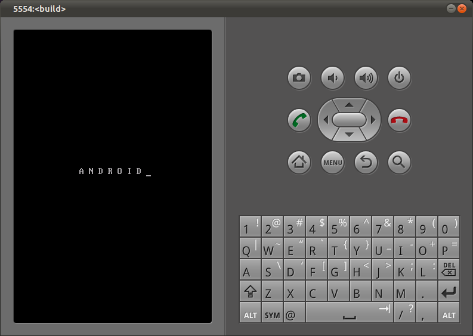

# 启动徽标

不计引导程序可能在启动时显示的内容，Android 设备的屏幕在启动过程中通常经历四个阶段：

1. **内核启动屏幕** — 通常 Android 设备在启动期间不会将内核启动信息显示到 LCD 屏幕。
2. **Init 启动徽标** — 这是 init 在初始化控制台的非常早期阶段显示的文本字符串或图像。
3. **启动动画** — 这是一系列动画图像，可能循环播放，在 Surface Flinger 启动期间显示。
4. **主屏幕** — 这是启动序列完全结束时激活的 Launcher 的起始屏幕。

init 尝试从 `/initlogo.rle` 文件加载徽标图像并显示到屏幕。如果找不到该文件，则显示熟悉的文本字符串（如图 6-6 所示）。



如果你想更改该字符串，请查看 `system/core/init/init.c` 中的 `console_init_action()`。如果你想显示图形徽标而不是纯文本，你需要创建一个正确的 `initlogo.rle`。

首先，你需要确定设备的屏幕大小。例如，假设你有一个该尺寸的 PNG：

```bash
$ convert -depth 8 acmelogo.png rgb:acmelogo.raw
$ rgb2565 -rle < acmelogo.raw > acmelogo.rle
```

然后你可以通过修改 CoyotePad 的 `full_coyote.mk` 来复制：

```bash
PRODUCT_COPY_FILES += \
        device/acme/coyotepad/acmelogo.rle:root/initlogo.rle
```
