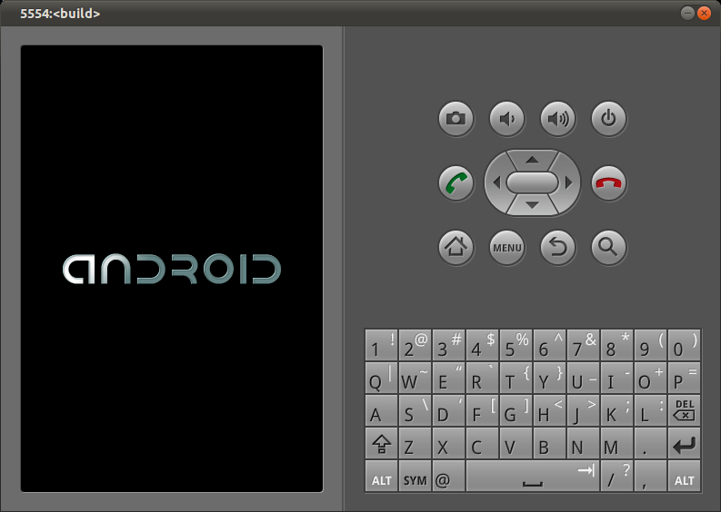

# Android 框架层

最终目标就是让你的嵌入式系统运行起用户和开发者所熟悉的 Android 环境，而不仅仅是我们在上一章所介绍的原生用户空间。这不仅包括完整的系统服务集合和提供标准 API 供应用开发者使用的包，还包括一些不太可见的组件，如支持系统服务运行的一系列原生守护进程，以及硬件抽象层（HAL）。本章将介绍 Android 框架层如何在原生用户空间之上运作，并讨论如何与它进行交互和定制。

值得注意的是，与之前讨论过的 Android 组件不同——那些组件可以通过多种方式修改其行为——Android 框架层大多数情况下只能原样使用。例如，你无法选择运行哪些系统服务，因为它们不是从脚本或配置文件中启动的。相反，修改框架层通常需要深入其源码和/或添加你自己的代码来定制其行为。

因此，这类定制工作要求你对 Android 源码有深入的了解，并且本质上与版本相关。不过，我们会尽量涵盖足够多的核心内容，使你能够开始自行探索 Android 的内部结构。尽管如此，请做好长期投入的准备，因为 Android 源码相当庞大，而且新版本发布的速度非常快。

## 什么是"Android 框架层"？

回顾图 2-1，Android 框架层包括 android.* 包、系统服务、Android 运行时以及部分原生守护进程。从源码角度来说，Android 框架层通常由 AOSP 中 `frameworks/` 目录下所有代码组成。

在某种程度上，我在本书中使用"Android 框架层"来指代在原生用户空间之上运行的几乎所有"Android"相关的内容。因此，我在本章中的解释有时会超出 `frameworks/` 目录的范围——比如 Dalvik 和 HAL，它们本质上是 Android 框架层不可或缺的组成部分。

## 框架层的启动

我们在上一章结尾介绍了 init 命令，以及如何配置和使用它。然而，在描述默认的 init.rc 时，我仅仅简要暗示了 Android 框架层是如何通过 Zygote 启动的。这个话题当然有很多可以展开讨论的内容，我们稍后就会看到。之前章节中描述的许多内容可以很容易地与嵌入式 Linux 世界中存在的组件进行类比；但接下来的内容几乎没有任何可类比的对象。的确，Android 开发人员对移动世界的贡献，正是他们在 BSD/ASL 许可的嵌入式 Linux 等价物之上所构建的那一套技术栈。

### 不带框架层构建 AOSP

尽管听起来有些奇怪，但在某些情况下，你可能确实希望构建不带任何华丽的、基于 Java 的系统服务和应用的 AOSP——而这些正是 Android 最广为人知的东西。无论是为了在"无头"（headless）系统上运行"Android"，还是仅仅因为正在进行主板移植工作，希望获得一个最小的 AOSP 构建来获取原生用户空间的基本工具和环境——有一个专门为此准备的 AOSP 构建版本：**Tiny Android**。

要使 AOSP 生成 Tiny Android，你只需进入 AOSP 的源码目录并输入以下命令：

```
$ BUILD_TINY_ANDROID=true make -j16
```

这将生成一组包含最小 Android 组件集的输出镜像，以便与内核一起运行一个功能性的原生 Android 用户空间。主要你会得到 Toolbox、Bionic、init、adbd、logcat、sh 以及其他一些关键的二进制文件和库。这些镜像中将不包含任何 Android 框架层的组件，比如系统服务或任何应用。

这是否还算"Android"确实值得商榷，但在某些情况下，这恰恰正是你想要的。至于最终结果是否应该被称为"Android"，这完全取决于你自己。话说回来，美丑自在观者心中。

### 核心构建块

框架层的运行依赖于少数几个关键的构建块：**服务管理器**（Service Manager）、**Android 运行时**（Android Runtime）、**Zygote** 和 **Dalvik**。没有这些，就没有任何我们知道是 Android 的组件能够工作。我们之前在第 2 章已经介绍过它们各自在系统启动中的作用。我鼓励你回到那一章进行深入阅读，但在我们刚刚了解了 init 及其脚本之后，这里仍然值得回顾一下要点。事实上，在你阅读下面的解释时，你可能希望手边有附录 D 中关于主要 init.rc 文件的内容。

init 启动的首批服务之一是 **servicemanager**。正如我之前解释的，它是所有系统服务的"黄页"或目录。显然，在它启动时还没有任何系统服务启动，但它必须非常早地可用，以便启动的系统服务能够向它注册，从而对系统的其余部分可见。

如果 servicemanager 没有运行，任何系统服务都无法宣传自己，框架层根本就无法工作。因此，servicemanager 不是可选组件，它在 init.rc 文件中的顺序也不允许定制。你必须按照默认的方式将其保留在 main init.rc 文件中的原位置，以及为它指定的默认选项。

接下来启动的核心组件是 **Zygote**。以下是 init.rc 中的相关行：

```
service zygote /system/bin/app_process -Xzygote /system/bin --zygote --start-system-server
```

这简单的一行包含了很多内容。首先，请注意实际运行的是 `app_process` 命令。以下是它的正式参数列表：

```
Usage: app_process [java-options] cmd-dir start-class-name [options]
```

`app_process` 是一个鲜为人知但功能强大的命令。它允许你直接从命令行启动一个新的 Dalvik 虚拟机来运行 Android 代码。这并不意味着你可以用它从命令行启动常规的 Android 应用——事实上你不能——但你很快就会了解到一个确实可以做到这一点的命令：`am`。然而，某些关键的系统组件和工具必须从命令行启动，且不引用任何现有的 Dalvik 虚拟机实例。Zygote 就是其中之一，因为它是第一个运行的 Dalvik 进程；`am` 和 `pm` 是另外两个，我们稍后会介绍。

为了实现其功能，`app_process` 依赖 **Android 运行时**。作为共享库 `libandroid_runtime.so` 打包，Android 运行时能够为运行 Android 类型代码的目的启动和管理 Dalvik 虚拟机。此外，它还会预加载大量通常被任何依赖 Android API 的代码所使用的库，包括任何 Android 框架层 Java 代码所需的原生调用。这些都被注册到虚拟机中，这样每当 Android 框架层的 Java 代码调用某个原生函数时，虚拟机就能找到它们。

运行时还包括一些为所有在 Dalvik 上运行的 Android 类型应用提供便利操作的函数。事实上，你可以将 Dalvik 看作是一个非常原始、低级的虚拟机，它并不假设你在它之上运行 Android 类型的代码。为了在 Dalvik 上运行依赖 Android Java API 的 Java 代码，运行时需要用专门为其定制的参数来启动 Dalvik——无论是公开记录在开发者文档中并通过 SDK 提供的公共 API，还是仅在作为 AOSP 内部代码构建时才可用的内部 API。

此外，运行时还依赖许多原生用户空间功能。例如，它会考虑 init 维护的一些全局属性，以控制 Dalvik 虚拟机的启动，还会使用 Android 的日志函数来记录 Dalvik 虚拟机初始化的进度。除了设置用于启动运行 Java 代码的 Dalvik 虚拟机的参数外，运行时还会在调用代码的 `main()` 方法之前初始化 Java 和 Android 环境的一些关键方面。最重要的是，它为在新实例化虚拟机上运行的所有线程提供了一个默认的异常处理器。

请注意，运行时不会预加载类：那是 Zygote 在为运行 Android 应用设置系统时做的事情。而且，由于每次使用 `app_process` 命令都会导致启动一个独立的虚拟机，所有非 Zygote 的 Dalvik 实例都会按需加载类，而不是在你的代码开始运行之前就加载。

### Dalvik 的全局属性

除了我们在上一章讨论的由 init 维护的全局属性之外，Dalvik 还通过 `java.lang.System` 继续提供属性系统。因此，如果你浏览一些系统服务的源码，可能会注意到对 `System.getProperty()` 或 `System.setProperty()` 的调用。请注意，这些调用及其底层属性集与 init 的全局属性完全独立。

例如，包管理器服务（Package Manager Service）在启动时会读取 `java.boot.class.path`。然而，如果你在命令行使用 `getprop`，你不会在 init 返回的属性列表中找到这个属性。相反，这类变量是在每个 Dalvik 实例中维护的，供运行的 Java 代码检索和/或使用。例如，特定的 `java.boot.class.path` 是在 `dalvik/vm/Properties.c` 中使用 init.rc 中设置的 `BOOTCLASSPATH` 变量来设置的。

你可以在 Java 官方文档中找到更多关于 Java 系统属性的信息。请注意，init 全局属性使用的变量名语义与 Java 系统属性使用的非常相似。

一旦启动，使用 `app_process` 启动的 Java 类就可以开始使用"常规"Android API 并与现有系统服务通信。如果它是作为 AOSP 的一部分构建的，它可以使用在构建时对其可用的许多 `android.*` 包。例如，`am` 和 `pm` 命令正是这样做的。因此，你同样可以编写自己的完全用 Java 编写的命令行工具，使用 Android API，并让它独立于 Zygote 以及 Zygote 导致启动的所有其他内容而启动和运行。

但这仍然不能让你编写一个由 `app_process` 启动的常规 Android 应用。Android 应用只能由活动管理器（Activity Manager）使用 intent 来启动，而活动管理器本身是在 Zygote 启动后作为其他系统服务的一部分启动的。这又把讨论带回到 Zygote 的启动。

为了让 Zygote 正确启动并让它启动系统服务器，你必须保持 init.rc 中相应的 `app_process` 行完好无损，并位于默认位置。关于 Zygote 的启动，没有什么是你可以配置的。不过，你可以通过修改一些系统全局属性来影响 Android 运行时启动任何 Dalvik 虚拟机的方式。你可以查看 2.3/Gingerbread 或 4.2/Jelly Bean 中 `frameworks/base/core/jni/AndroidRuntime.cpp` 里的 `AndroidRuntime::startVm(JavaVM** pJavaVM, JNIEnv** pEnv)` 函数，看看 Android 运行时在准备启动新虚拟机时读取了哪些全局属性。请注意，使用这些属性来影响 Dalvik 虚拟机设置很可能与特定版本相关。

一旦 Zygote 的虚拟机启动，就会调用 `com.android.internal.os.ZygoteInit` 类的 `main()` 函数，它会预加载整套 Android 包，然后启动系统服务器，接着开始循环监听来自活动管理器的连接请求——活动管理器请求 Zygote fork 并启动新的 Android 应用。同样，这里没有什么可以定制的，除非你能在 `frameworks/base/core/java/com/android/internal/os/ZygoteInit.java` 中 `startSystemServer()` 函数使用的参数列表中找到与你相关的内容。我的建议是，除非你对 Android 的内部结构有非常扎实的理解，否则请保持原样。

### 禁用 Zygote

虽然你无法配置 Zygote 在启动时做什么，但你仍然可以通过在 init.rc 中为其添加 `disabled` 选项来完全禁用它的启动。以下是 2.3/Gingerbread 中的做法：

```
service zygote /system/bin/app_process -Xzygote /system/bin --zygote --start-system-server
    socket zygote stream 666
    onrestart write /sys/android_power/request_state wake
    onrestart write /sys/power/state on
    onrestart restart media
    onrestart restart netd
    disabled
```

这将有效地阻止 init 在启动时启动 Zygote，因此 Android 框架层的任何部分都不会启动，包括系统服务器。如果你正在调试关键的系统错误或开发某个 HAL 模块，并且必须在关键系统服务启动之前手动设置调试工具、加载文件或监控系统行为，这可能会非常有用。

之后你可以手动启动 Zygote 及系统其余部分：

```
# start zygote
```

## 系统服务

正如我们在上一节看到的，系统服务器是作为 Zygote 启动的一部分而启动的，我们将在本节继续深入探讨这个过程。然而，正如第 2 章所讨论的，也有从系统服务器以外的进程启动的系统服务，我们将在本节讨论这些。

从 4.0/Ice-Cream Sandwich 开始，第一个启动的系统服务是 **Surface Flinger**。在 2.3/Gingerbread 及之前，它一直是作为系统服务器的一部分启动的，但到了 4.0/Ice-Cream Sandwich，它在 Zygote 之前就已启动，独立于系统服务器和其他系统服务运行。以下是 4.2/Jelly Bean 的 init.rc 中 Zygote 条目之前的相关片段：

```
service surfaceflinger /system/bin/surfaceflinger
    class main
    user system
    group graphics drmrpc
    onrestart restart zygote
```

Surface Flinger 的源码在 2.3/Gingerbread 的 `frameworks/base/services/surfaceflinger/` 和 4.2/Jelly Bean 的 `frameworks/native/services/surfaceflinger/` 中。它的作用是将应用使用的绘图表面（drawing surfaces）合成为显示给用户的最终图像。因此，它是 Android 最基本的构建块之一。

在 Android 4.0 中，由于 Surface Flinger 在 Zygote 之前启动，系统的启动动画比以前版本出现得更快。我们将在本章稍后讨论启动动画。

为了启动系统服务器，Zygote fork 并运行 `com.android.server.SystemServer` 类的 `main()` 函数。后者加载包含部分系统服务所需 JNI 部分的 `libandroid_servers.so` 库，然后调用 `frameworks/base/cmds/system_server/library/system_init.cpp` 中的原生代码，启动在 system_server 进程中运行的 C 代码系统服务。在 2.3/Gingerbread 中，这包括 Surface Flinger 和传感器服务（Sensor Service）。然而在 4.2/Jelly Bean 中，Surface Flinger 是单独启动的（正如我们刚刚看到的），而由 system_server 启动的唯一 C 代码系统服务是传感器服务。

然后系统服务器回到 Java 领域，开始初始化关键的系统服务，如电源管理器（Power Manager）、活动管理器和包管理器。随后继续初始化它托管的所有系统服务，并将它们注册到服务管理器中。这一切都是在 `frameworks/base/services/java/com/android/server/SystemServer.java` 的代码中完成的。这一切都是不可配置的。它被硬编码到 `SystemServer.java` 中，没有你可以传递的标志或参数来告诉系统服务器不启动某些系统服务。如果你想禁用任何一个，就必须亲自动手注释掉相应的代码。

系统服务之间是相互依赖的，Android 的几乎所有部分——包括 Android API——都假设所有内置于 AOSP 的系统服务始终可用。正如我在第 2 章提到的，系统服务整体上构成了构建在 Linux 之上的面向对象操作系统——而且这个操作系统的各个部分并不是为模块化而构建的。因此，如果你去掉其中一个系统服务，Android 的某些部分很可能就会开始出现故障。

但这并不意味着不能做到。作为 2012 年 Android Builders Summit 上一个题为"无头 Android"（Headless Android）演讲的一部分，我展示了我如何成功禁用了 Surface Flinger、窗口管理器（Window Manager）和其他几个关键系统服务，从而在无头系统上运行完整的 Android 栈。正如我在那次演讲中警告的那样，这项工作在很大程度上是一个概念验证，如果要达到生产就绪，还需要更多的努力。

因此，尽管去折腾吧，但你已经被警告了——如果你要在 Android 的核心深处玩这么深，最好做好准备。

### /system/bin/system_server 是什么？

你可能在浏览目标的根文件系统时注意到，`/system/bin` 中有一个名为 `system_server` 的二进制文件。然而，这个二进制文件与系统服务器的启动或任何系统服务都无关。目前尚不清楚这个二进制文件有什么用途（如果有的话）。这很可能是 Android 早期的遗留工具。

这个事实往往是混淆的来源，因为快速查看二进制文件列表和 `ps` 输出可能会让你相信 `system_server` 进程实际上是由 `system_server` 命令启动的。我实际上对自己阅读源码的结果持怀疑态度，并在 android-building 邮件列表上发布了相关问题。然而，后续的回复似乎证实了我自己对源码的理解。

### mediaserver

除了 Surface Flinger 和系统服务器启动的系统服务之外，另一组系统服务源自 **mediaserver** 的启动。以下是 2.3/Gingerbread init.rc 中的相关片段（4.2/Jelly Bean 的版本几乎相同）：

```
service media /system/bin/mediaserver
    user media
    group system audio camera graphics inet net_bt net_bt_admin net_raw
    ioprio rt 4
```

mediaserver（源码在 2.3/Gingerbread 的 `frameworks/base/media` 和 4.2/Jelly Bean 的 `frameworks/av/media`）启动以下系统服务：**音频流管理器**（Audio Flinger）、**媒体播放器服务**（Media Player Service）、**相机服务**（Camera Service）和**音频策略服务**（Audio Policy Service）。同样，这些都不可配置，建议你不要修改 init.rc 的相关部分，除非你完全理解修改的影响。例如，如果你试图从 init.rc 中移除 mediaplayer 服务的启动，或使用 `disabled` 选项阻止其启动，你会在 logcat 输出中看到这样的消息：

```
...
I/ServiceManager(   56): Waiting for service media.audio_policy...
I/ServiceManager(   56): Waiting for service media.audio_policy...
W/AudioSystem(   56): AudioPolicyService not published, waiting...
I/ServiceManager(   56): Waiting for service media.audio_policy...
...
```

系统将挂起，并继续打印这些消息，直到 mediaserver 启动。

请注意，mediaserver 是使用 `ioprio` 选项的少数 init 服务之一。据推测——不幸的是没有官方文档确认——这用于确保媒体播放具有适当的优先级，以避免播放不流畅。

最后还有一个比较特殊的参与者：提供 Phone 系统服务的**电话应用**（Phone app）。一般来说，应用是放置系统服务的错误地方，因为应用是生命周期管理的，因此可以随意停止和重启。然而系统服务应该从启动到重启一直存在，因此不能在不影响系统其余部分的情况下中途停止。然而 Phone 应用不同，因为它的清单文件在 application XML 元素的 `android:persistent` 属性设置为 `true`。这向系统表明这个应用不应该被生命周期管理，从而使其能够承载一个系统服务。

这也导致这个应用作为活动管理器初始化的一部分被自动启动。

同样，关于 Phone 应用的启动，没有什么通常是可以配置的。不过，你相对容易地从内置于 AOSP 的应用列表中移除 Phone 应用。然而，结果是，依赖该系统服务的系统任何部分都将无法正常工作。再说一次，你不妨保留它。如果你想从主屏幕上移除拨号器图标，那你实际想要移除的是**通讯录应用**（Contacts app）。尽管这可能听起来违反直觉，但 Android 用户习惯的那个典型电话拨号器并不属于 Phone 应用——它是通讯录应用的一部分。

另一个包含系统服务的应用例子是 `packages/apps/Nfc/` 中的 NFC 应用。

Phone 应用提供系统服务的方式非常有趣，因为它为我们打开了一扇门——我们可以效仿它的例子，将系统服务作为应用添加到我们自己的 `device/acme/coyotepad/` 目录中，而无需修改 `frameworks/base/services/` 中默认系统服务的源码。

## 启动动画

正如在上一章讨论启动 logo 时所解释的，Android 的 LCD 在启动过程中经历四个阶段。其中之一就是启动动画。以下是 2.3/Gingerbread init.rc 中的相关条目（4.2/Jelly Bean 中的条目几乎相同）：

```
service bootanim /system/bin/bootanimation
    user graphics
    group graphics
    disabled
    oneshot
```

请注意，这个服务被标记为 `disabled`。因此，init 实际上不会立即启动它。相反，它必须在其他地方被明确启动。在这种情况下，是由 Surface Flinger 在完成自己的初始化后，通过设置 `ctl.start` 全局属性来实际启动启动动画。以下是 2.3/Gingerbread 的 `frameworks/base/services/surfaceflinger/SurfaceFlinger.cpp` 中 `SurfaceFlinger::readyToRun()` 函数的相关代码：

```cpp
// start boot animation
property_set("ctl.start", "bootanim");
```

4.2/Jelly Bean 的 `frameworks/native/services/surfaceflinger/SurfaceFlinger.cpp` 中的代码做的事情实质相同：

```cpp
void SurfaceFlinger::startBootAnim() {
    // start boot animation
    property_set("service.bootanim.exit", "0");
    property_set("ctl.start", "bootanim");
}
...
status_t SurfaceFlinger::readyToRun()
{
...
    // start boot animation
    startBootAnim();
    return NO_ERROR;
}
...
```

鉴于 Surface Flinger 是最早启动的系统服务之一（如果不是最早的话），启动动画最终会在系统关键部分初始化时持续显示。通常，它只会在手机主屏幕最终出现时才停止。我们稍后会看看启动动画过程中发生的一些事情。

正如你在前面的 init.rc 片段中看到的，bootanim 服务对应的是 `bootanimation` 二进制文件。后者的源码在 `frameworks/base/cmds/bootanimation/`，如果你深入研究，你会发现这个工具直接通过 Binder 与 Surface Flinger 通信以渲染其动画；因此，Surface Flinger 需要在动画开始之前就已运行。图 7-1 展示了 bootanimation 显示的默认 Android 启动动画，其中带有投射在 Android logo 上的移动光线效果。



bootanimation 实际上有两种操作模式。在一种模式下，它使用 `frameworks/base/core/res/assets/images/` 中的图像创建默认的 Android logo 启动动画。最好不要尝试通过修改这些文件来修改启动动画。相反，通过提供 `/data/local/bootanimation.zip` 或 `/system/media/bootanimation.zip`，你将强制 bootanimation 进入另一种操作模式——使用其中一个 ZIP 文件的内容来渲染启动动画。尽管一本书不是展示运行动画的理想媒介，但值得花一些时间来了解如何做到这一点。

### bootanimation.zip

bootanimation.zip 是一个常规的未压缩 ZIP 文件，其顶层目录中至少包含一个 `desc.txt` 文件，以及包含 PNG 文件的一些目录。后者根据 `desc.txt` 文件中的规则按顺序进行动画处理。请注意，bootanimation 不支持 PNG 以外的文件。以下是 `desc.txt` 文件的语义规范：

```
<width> <height> <fps>
p <count> <pause> <path>
p <count> <pause> <path>
```

请注意，该文件的格式非常简单，不允许任何多余的内容。所以请严格遵循上述语义。第一行表示动画的宽度、高度和帧率（每秒帧数）。每个后续的行都是动画的一个部分。对于每个部分，你必须提供该部分播放的次数（count）、每次播放后暂停的帧数（pause）以及该部分动画所在目录的路径（path）。各部分按它们在 desc.txt 中出现的顺序播放。

每个动画部分（以及因此相关的目录）由多个 PNG 文件组成，文件名是用作该帧在完整序列中序列号的字符串。例如，文件可以命名为 001.png、002.png、003.png 等。如果 count 设置为 0，该部分将循环播放，直到系统完成启动且启动器启动。通常，初始部分的 count 可能是 1，而最后一部分的 count 通常为 0，这样它会继续播放直到启动完成。

创建你自己的启动动画的最佳方式是查看他人创建的现有 bootanimation.zip 文件。如果你用你喜欢的搜索引擎搜索那个文件名，应该能相对容易地找到一些例子。例如，看看 CyanogenMod 第三方 Android 发行版创建的一些最新启动动画。

再次强调，确保你创建的 ZIP 文件没有被压缩。否则它将无法工作。请查看 `zip` 命令的手册页面——特别是 `-0` 标志。

### 禁用启动动画

如果你不想要启动动画，也可以完全禁用它。只需在 init.rc 中使用 `setprop` 命令将 `debug.sf.nobootanimation` 设置为 1：

```
setprop debug.sf.nobootanimation 1
```

在这种情况下，在启动 logo 显示之后，屏幕会在某个时候变黑，并保持黑屏，直到启动器应用显示主屏幕。

## Dex 优化

启动动画期间启动的系统服务之一是**包管理器**（Package Manager）。我们还没有详细介绍它的功能，但简而言之，包管理器管理系统中所有的 `.apk`。除其他外，它处理 `.apk` 的安装和卸载，并帮助活动管理器解析 intent。

包管理器的职责之一也是在相应的 Java 代码执行之前，确保任何 DEX 字节码的 JIT 优化版本都可用。为了实现这一点，包管理器服务（实现为 Java 类）的构造函数会遍历系统中所有的 `.apk` 和 `.jar` 文件，并请求 installd 对它们运行 dexopt 命令。

这个过程只应在首次启动时发生。随后，`/data/dalvik-cache` 目录将包含所有 .dex 文件的 JIT 优化版本，后续启动应该会快得多。如果你查看首次启动时 logcat 的输出，你实际上会看到这样的条目：

```
D/dalvikvm(   32): DexOpt: --- BEGIN 'core.jar' (bootstrap=1) ---
D/dalvikvm(   62): Ignoring duplicate verify attempt on Ljava/lang/Object;
D/dalvikvm(   62): Ignoring duplicate verify attempt on Ljava/lang/Class;
D/dalvikvm(   62): DexOpt: load 349ms, verify+opt 4153ms
D/dalvikvm(   32): DexOpt: --- END 'core.jar' (success) ---
D/dalvikvm(   32): DEX prep '/system/framework/core.jar': unzip in 405ms, rewrite 5337ms
D/dalvikvm(   32): DexOpt: --- BEGIN 'bouncycastle.jar' (bootstrap=1) ---
D/dalvikvm(   63): DexOpt: load 54ms, verify+opt 779ms
D/dalvikvm(   32): DexOpt: --- END 'bouncycastle.jar' (success) ---
D/dalvikvm(   32): DEX prep '/system/framework/bouncycastle.jar': unzip in 48ms, rewrite 1023ms
...
```

最初，包管理器服务尚未运行，因此我们可以看到 Dalvik 直接运行 dexopt 来处理某些 `.jar` 文件，而不是像包管理器服务请求时那样由 installd 运行。一旦包管理器启动，它会按以下顺序运行其余的优化过程：

1. init.rc 中 `BOOTCLASSPATH` 变量中列出的 `.jar` 文件
2. `/system/etc/permission/platform.xml` 中作为库列出的 `.jar` 文件
3. `/system/framework` 中找到的 `.apk` 和 `.jar` 文件
4. `/system/app` 中找到的 `.apk` 文件
5. `/vendor/app` 中找到的 `.apk` 文件
6. `/data/app` 中找到的 `.apk` 文件
7. `/data/app-private` 中找到的 `.apk` 文件

显然，这个过程需要一些时间。在我的四核 CORE i7 上，新编译的 2.3/Gingerbread AOSP 模拟器镜像的首次完整启动（即到主屏幕）需要 75 秒，后续启动需要 24 秒。在生产系统（如手机）上，这样的启动时间可能是无法接受的。

因此，你可能会很高兴听到，你实际上可以在构建时而不是启动时执行这个优化过程。构建 AOSP 时只需设置 `WITH_DEXPREOPT` 构建标志为 true：

```
$ make WITH_DEXPREOPT=true -j16
```

你也可以将这个变量设置在你的设备的 `BoardConfig.mk` 中，从而避免每次都要在 make 命令中添加它。就模拟器构建而言，在 2.3/Gingerbread 中默认没有这样做，但在 4.2/Jelly Bean 中是这样做的。

构建当然会花费更多时间，但在首次启动时会明显更快。在前面提到的工作站上，构建 2.3/Gingerbread 需要 30 分钟而不是 20 分钟（使用 `WITH_DEXPREOPT` 标志）。然而，模拟器镜像在首次启动时 40 秒而不是 75 秒就能启动。当使用该选项时，首次启动后目标的 `/data/dalvik-cache` 目录最终将为空。相反，在构建时，`.odex` 文件被放置在与它们对应的 `.jar` 和 `.apk` 文件相同的文件系统路径中。

## 应用启动

随着系统服务启动接近尾声，应用开始被激活，包括主屏幕。正如我在第 2 章所解释的，活动管理器通过发送类型为 `Intent.CATEGORY_HOME` 的 intent 结束其初始化，这会导致启动器应用启动并显示主屏幕。但这只是故事的一部分。系统服务的启动实际上会导致相当多的应用启动。以下是刚启动的 2.3/Gingerbread 模拟器镜像上 `ps` 命令的部分输出：

```
# ps
...
root      32    1     60832  16240 c009b74c afd0b844 S zygote
media     33    1     17976  1056  ffffffff afd0b6fc S /system/bin/mediaserver
bluetooth 34    1     1256   220   c009b74c afd0c59c S /system/bin/dbus-daemon
root      35    1     812    232   c02181f4 afd0b45c S /system/bin/installd
keystore  36    1     1744   212   c01b52b4 afd0c0cc S /system/bin/keystore
root      38    1     824    268   c00b8fec afd0c51c S /system/bin/qemud
shell     40    1     732    200   c0158eb0 afd0b45c S /system/bin/sh
root      41    1     3364   168   ffffffff 00008294 S /sbin/adbd
system    61    32    124096 26352 ffffffff afd0b6fc S system_server
app_19    113   32    80336  17400 ffffffff afd0c51c S com.android.inputmethod.latin
radio     121   32    87112  17972 ffffffff afd0c51c S com.android.phone
system    122   32    73160  18452 ffffffff afd0c51c S com.android.systemui
app_26    132   32    76608  20812 ffffffff afd0c51c S com.android.launcher
app_1     169   32    85368  20584 ffffffff afd0c51c S android.process.acore
app_12    234   32    70752  15748 ffffffff afd0c51c S com.android.quicksearchbox
app_8     242   32    73108  16908 ffffffff afd0c51c S android.process.media
app_10    266   32    70928  16572 ffffffff afd0c51c S com.android.providers.calendar
app_29    300   32    72764  17484 ffffffff afd0c51c S com.android.email
app_18    315   32    70272  15428 ffffffff afd0c51c S com.android.music
app_22    323   32    69712  15220 ffffffff afd0c51c S com.android.protips
app_3     335   32    71432  16756 ffffffff afd0c51c S com.cooliris.media
...
```

所有具有 Java 风格进程名的进程实际上都是在系统启动时无需任何用户干预而自动启动的应用。各种系统机制根据它们各自清单文件的内容导致这些应用启动。

这是一个可喜的变化，因为与应用激活控制相比，控制启动所需的内部工作要比控制我们上面看到的启动的许多其他方面少得多。相反，这完全取决于为与 AOSP 打包而精心制作的应用。当然，在某些情况下，你会想要修改一个库存应用以使其行为或启动方式不同，但至少我们进入了应用世界，在这个世界里，功能更加松散耦合，文档也更易于获取。

这就引出了我们接下来要讨论的内容：什么触发了库存应用被激活。

### 输入法

最早启动的应用类型之一是**输入法**。输入法管理器服务（Input Method Manager Service）的构造函数会遍历并激活所有具有 `android.view.InputMethod` intent 过滤器的应用服务。例如，这就是 LatinIME 应用（作为 `com.android.inputmethod.latin` 进程运行）被激活的方式。

正如你可以通过阅读 Android 开发者博客上的"创建输入法"博客文章所看到的，输入法实际上是精心设计的服务。

### 持久化应用

在其清单文件的 `<application>` 元素的 `android:persistent="true"` 属性的应用将在启动时由活动管理器自动生成。事实上，如果这样的应用死亡了，活动管理器也会自动重新启动它。

正如我之前解释的，与普通应用不同，标记为持久化的应用不受活动管理器的生命周期管理。相反，它们在整个系统生命周期中保持活力。这允许使用此类应用来实现特殊功能。例如，作为 `com.android.systemui` 和 `com.android.phone` 进程运行的状态栏和电话应用就是持久化应用。

尽管应用开发文档确实解释了 `android:persistent` 的作用，但该属性的使用保留给在 AOSP 内构建的应用。

### 主屏幕

通常只有一个主屏幕应用，它对 `Intent.CATEGORY_HOME` intent 做出反应，该 intent 由活动管理器在系统服务启动结束时发送。`development/samples/Home/` 中有一个示例主应用，但实际激活的主应用在 `packages/apps/Launcher2/` 中。以下是 2.3/Gingerbread 中启动器的主 activity 及其 intent 过滤器（4.2/Jelly Bean 的基本相同）：

```xml
<activity
    android:name="com.android.launcher2.Launcher"
    android:launchMode="singleTask"
    android:clearTaskOnLaunch="true"
    android:stateNotNeeded="true"
    android:theme="@style/Theme"
    android:screenOrientation="nosensor"
    android:windowSoftInputMode="stateUnspecified|adjustPan">
    <intent-filter>
        <action android:name="android.intent.action.MAIN" />
        <category android:name="android.intent.category.HOME" />
        <category android:name="android.intent.category.DEFAULT" />
        <category android:name="android.intent.category.MONKEY"/>
    </intent-filter>
</activity>
```

显然，如果你想像 Launcher2 一样启动一个自定义应用作为主屏幕，你需要移除 Launcher2 并添加你自己的、能够对该相同 intent 做出反应的应用。如果有多个应用对该 intent 做出反应，用户将获得一个对话框，询问他们想要使用哪个主屏幕。

请注意，这个 intent 不仅在启动时发送。根据系统的状态，活动管理器将在需要将主屏幕带到前台时发送此 intent。

### BOOT_COMPLETED intent

活动管理器还会在启动时广播 `Intent.BOOT_COMPLETED` intent。这是一个应用常用来接收系统已完成启动通知的 intent。AOSP 中的许多库存应用实际上依赖这个 intent，如媒体提供者（Media Provider）、日历提供者（Calendar provider）、Mms 应用和电子邮件应用。以下是 2.3/Gingerbread 中媒体提供者使用的广播接收器及其 intent 过滤器（4.2/Jelly Bean 的非常相似）：

```xml
<receiver android:name="MediaScannerReceiver">
    <intent-filter>
        <action android:name="android.intent.action.BOOT_COMPLETED" />
    </intent-filter>
    <intent-filter>
        <action android:name="android.intent.action.MEDIA_MOUNTED" />
        <data android:scheme="file" />
    </intent-filter>
    <intent-filter>
        <action android:name="android.intent.action.MEDIA_SCANNER_SCAN_FILE" />
        <data android:scheme="file" />
    </intent-filter>
</receiver>
```

为了接收此 intent，应用必须明确请求相应的权限：

```xml
<uses-permission android:name="android.permission.RECEIVE_BOOT_COMPLETED" />
```

### APPWIDGET_UPDATE intent

除了应用之外，应用小组件服务（App Widget Service）——它本身是一个系统服务——注册自己接收 `Intent.BOOT_COMPLETED`。它使用收到此 intent 作为触发器，通过发送 `Intent.APPWIDGET_UPDATE` 来激活系统中所有的应用小组件。因此，如果你在你的应用中开发了一个应用小组件，你的代码将在此时被激活。关于如何编写你自己的应用小组件的更多信息，请参阅 Android 开发者文档中的应用小组件部分。

AOSP 中有多个库存应用有应用小组件，如快速搜索框（Quick Search Box）、音乐、提示和媒体。例如，以下是快速搜索框在其清单文件中声明的应用小组件：

```xml
<receiver android:name=".SearchWidgetProvider"
          android:label="@string/app_name">
    <intent-filter>
        <action android:name="android.appwidget.action.APPWIDGET_UPDATE" />
    </intent-filter>
    <meta-data android:name="android.appwidget.provider" android:resource="@xml/search_widget_info" />
</receiver>
```

## 工具和命令

一旦框架层和基本应用集启动并运行，有相当多的命令可用于查询系统服务或与之交互。与第 6 章中介绍的命令非常相似，这些命令可以在你 shell 登录设备后从命令行使用。但是，这些命令在框架层不运行时没有意义，因此也没有效果。当然，在你在新设备上启动 Android 和/或在新设备上调试框架层的某些部分时，你会发现其中许多命令非常有用，甚至至关重要。而且与第 6 章中的命令一样，用于与框架层交互的工具在文档和功能方面差异很大。但它们提供了在新硬件上启动 Android 或对现有产品进行故障排除所需的基本功能。让我们看看可用于与 Android 框架层交互的命令集。

这些命令中有许多位于 AOSP 源码的 `frameworks/base/cmds/` 目录中，不过在 4.2/Jelly Bean 中，其中一些命令已移至 `frameworks/native/cmds/`。我鼓励你在使用其中一些命令时参考这些源码，因为它们的效果并不总是通过在线帮助显而易见的。

### 通用工具

与我们后面将看到的一些工具不同，某些工具对于与框架层的各个部分进行交互非常有用。其中一些非常强大。

**service**

service 命令允许我们与向服务管理器注册的任何系统服务进行交互：

```
# service -h
Usage: service [-h|-?]
       service list
       service check SERVICE
       service call SERVICE CODE [i32 INT | s16 STR] ...
```

选项：
- `i32`：将整数 INT 写入发送的包中。
- `s16`：将 UTF-16 字符串 STR 写入发送的包中。

如你所见，它既可以用于查询，也可以用于调用系统服务的方法。以下是 2.3/Gingerbread 中用于查询现有系统服务列表的方法：

```
# service list
Found 50 services:
0 phone: [com.android.internal.telephony.ITelephony]
1 iphonesubinfo: [com.android.internal.telephony.IPhoneSubInfo]
2 simphonebook: [com.android.internal.telephony.IIccPhoneBook]
3 isms: [com.android.internal.telephony.ISms]
4 diskstats: []
5 appwidget: [com.android.internal.appwidget.IAppWidgetService]
6 backup: [android.app.backup.IBackupManager]
7 uimode: [android.app.IUiModeManager]
8 usb: [android.hardware.usb.IUsbManager]
9 audio: [android.media.IAudioService]
10 wallpaper: [android.app.IWallpaperManager]
11 dropbox: [com.android.internal.os.IDropBoxManagerService]
12 search: [android.app.ISearchManager]
13 location: [android.location.ILocationManager]
14 devicestoragemonitor: []
15 notification: [android.app.INotificationManager]
16 mount: [IMountService]
17 accessibility: [android.view.accessibility.IAccessibilityManager]
...
```

方括号中提供的接口名称允许你浏览 AOSP 源码，找到定义该接口的匹配的 `.aidl` 文件。

你还可以检查给定的服务是否存在：

```
# service check power
Service power: found
```

最有趣的是，你可以使用 `service call` 直接调用系统服务的 Binder 公开方法。为了做到这一点，首先需要理解该服务的接口。以下是 2.3/Gingerbread 中 `frameworks/base/core/java/com/android/internal/statusbar/IStatusBarService.aidl` 中的 `IStatusBarService` 接口定义（4.2/Jelly Bean 的接口名称相同，但 `setIcon()` 的原型已更改）：

```java
interface IStatusBarService
{
    void expand();
    void collapse();
    void disable(int what, IBinder token, String pkg);
    void setIcon(String slot, String iconPackage, int iconId, int iconLevel);
...
```

请注意，`service call` 实际上需要一个方法代码，而不是方法名称。要找到与方法名称匹配的方法代码，你需要查找根据接口定义由 aidl 工具生成的代码。以下是生成在 `out/target/common/obj/JAVA_LIBRARIES/framework_intermediates/src/core/java/com/android/internal/statusbar/` 中的 `IStatusBarService.java` 文件的相关片段：

```java
static final int TRANSACTION_expand = (android.os.IBinder.FIRST_CALL_TRANSACTION + 0);
static final int TRANSACTION_collapse = (android.os.IBinder.FIRST_CALL_TRANSACTION + 1);
static final int TRANSACTION_disable = (android.os.IBinder.FIRST_CALL_TRANSACTION + 2);
static final int TRANSACTION_setIcon = (android.os.IBinder.FIRST_CALL_TRANSACTION + 3);
...
```

此外，`frameworks/base/core/java/android/os/IBinder.java` 中对 `FIRST_CALL_TRANSACTION` 有如下定义：

```java
int FIRST_CALL_TRANSACTION  = 0x00000001;
```

因此，`expand()` 的代码是 1，`collapse()` 的代码是 2。因此，以下命令将导致状态栏展开：

```
# service call statusbar 1
```

而以下命令将导致状态栏收起：

```
# service call statusbar 2
```

这是一个非常简单的情况，动作相当明显，调用的方法不带任何参数。在其他情况下，你需要更仔细地查看系统服务的 API 并理解预期的参数。此外，请记住，系统服务的接口不一定通过 `.aidl` 文件公开。在某些情况下，如活动管理器，接口定义是直接硬编码到常规 Java 文件中而不是自动生成的。在基于 C 的系统服务的情况下，Binder 的封送（marshaling）和解封送（unmarshaling）都是直接在 C 代码中完成的。因此，除了在 AOSP 的 `frameworks/` 目录中使用 grep 之外，还要在 `out/target/common/` 中查找 `FIRST_CALL_TRANSACTION` 的所有实例。

**dumpsys**

另一件有趣的事情是查询系统服务的内部状态。实际上，每个系统服务在内部都实现了一个 `dump()` 方法，可以使用 `dumpsys` 命令进行查询：

```
dumpsys [ <service> ]
```

默认情况下，如果没有提供参数作为系统服务名称，dumpsys 将首先打印系统服务列表，然后转储它们的状态：

```
# dumpsys
Currently running services:
  SurfaceFlinger
  accessibility
  account
  activity
  alarm
  appwidget
  audio
  backup
  battery
  batteryinfo
  clipboard
  connectivity
  content
  cpuinfo
  device_policy
  devicestoragemonitor
  diskstats
  dropbox
  entropy
  hardware
...
-------------------------------------------------------------------------------
DUMP OF SERVICE SurfaceFlinger:
+ Layer 0x1e5788
      z=    21000, pos=(   0,   0), size=( 320, 480), needsBlending=0, needsDithering=0, invalidate=0, alpha=0xff, flags=0x00000000, tr=[1.00, 0.00][0.00, 1.00]
      name=com.android.internal.service.wallpaper.ImageWallpaper
      client=0x1ed2a8, identity=3
      [ head= 1, available= 2, queued= 0 ] reallocMask=00000000, identity=3, status=0
      format= 4, [320x480:320] [320x480:320], freezeLock=0x0, bypass=0, dq-q-time=2034 us
...
```

显然，输出非常冗长，最重要的是，需要理解相应系统服务的内部结构。但是，如果你正在实现你自己的系统服务，那么能够在运行时查询其状态可能至关重要。当然，如果你对转储所有系统服务状态不感兴趣，只需将你想要获取信息的特定服务的名称作为参数提供给 dumpsys：

```
# dumpsys power
Power Manager State:
  mIsPowered=true mPowerState=1 mScreenOffTime=46793204 ms
  mPartialCount=1
  mWakeLockState=SCREEN_ON_BIT
...
```

**dumpstate**

在某些情况下，你要做的可能是获取整个系统的快照，而不仅仅是系统服务。这就是 `dumpstate` 所负责的。实际上，你可能记得我们在第 6 章讨论 adb 的 bugreport 时提到过这个命令，因为 dumpstate 为 bugreport 提供其信息。以下是 2.3/Gingerbread 中 dumpstate 的详细帮助：

```
# dumpstate -h
usage: dumpstate [-d] [-o file] [-s] [-z]
  -d: append date to filename (requires -o)
  -o: write to file (instead of stdout)
  -s: write output to control socket (for init)
  -z: gzip output (requires -o)
```

在 4.2/Jelly Bean 中，dumpstate 的功能已扩展：

```
root@android:/ # dumpstate -h
usage: dumpstate [-b soundfile] [-e soundfile] [-o file [-d] [-p] [-z]] [-s] [-q]
  -o: write to file (instead of stdout)
  -d: append date to filename (requires -o)
  -z: gzip output (requires -o)
  -p: capture screenshot to filename.png (requires -o)
  -s: write output to control socket (for init)
  -b: play sound file instead of vibrate, at beginning of job
  -e: play sound file instead of vibrate, at end of job
  -q: disable vibrate
```

如果你不带任何参数调用它，它会继续查询系统的多个部分，以向你提供系统状态的完整快照。

在大多数情况下，正如你所看到的，dumpstate 实际上是在调用其他命令，如 logcat、dumpsys 和 ps 来检索其信息。如你所见，该命令非常冗长。

**rawbu**

在某些情况下，你可能希望备份 `/data` 的内容，以后再恢复它。你可以使用 `rawbu` 命令来做到这一点：

```
# rawbu help
Usage: rawbu COMMAND [options] [backup-file-path]
```

命令有：

- `help`：显示此帮助文本。
- `backup`：执行 `/data` 的备份。
- `restore`：执行 `/data` 的恢复。

选项包括：

- `-h`：显示此帮助文本。
- `-a`：备份所有文件。

`rawbu` 命令允许你对 `/data` 分区执行低级备份和恢复。这是保存所有用户数据的地方，允许相当完整地恢复设备的状态。请注意，因为这是低级的，它只适用于相同（或非常相似）设备软件之间的构建。

以下是如何创建备份的方法：

```
# rawbu backup /sdcard/backup.dat
Stopping system...
Backing up /data to /sdcard/backup.dat...
Saving dir /data/local...
Saving dir /data/local/tmp...
Saving dir /data/app-private...
Saving dir /data/app...
Saving dir /data/property...
Saving file /data/property/persist.sys.localevar...
Saving file /data/property/persist.sys.country...
Saving file /data/property/persist.sys.language...
Saving file /data/property/persist.sys.timezone...
...
Backup complete!  Restarting system...
```

该命令做的第一件事是停止 Zygote，从而停止所有系统服务。然后继续从 `/data` 复制所有内容，最后重新启动 Zygote。

备份数据后，你可以稍后恢复：

```
# rawbu restore /sdcard/backup.dat
Stopping system...
Wiping contents of /data...
Restoring from /sdcard/backup.dat to /data...
Restoring dir /data/local...
Restoring dir /data/local/tmp...
Restoring dir /data/app-private...
Restoring dir /data/app...
...
Restore complete!  Restarting system, cross your fingers...
```

显然，正如命令输出所暗示的，这是一个脆弱的操作，你应该知道结果会因情况而异。

### 服务专用工具

正如我们之前看到的，有数十个系统服务。通常，使用这些系统服务需要编写以某种方式与它们的 Binder 公开 API 交互的代码。然而，在某些情况下，AOSP 包含用于直接与某些系统服务交互的命令行工具。其中一些工具非常强大，允许我们直接从命令行利用 Android 的功能。这为在生产或开发过程中将许多以下实用程序作为脚本的一部分使用打开了大门。

**am**

正如我之前提到的，最重要的系统服务之一是活动管理器。因此，有一个命令允许我们直接调用其功能，这是理所当然的。以下是 2.3/Gingerbread 中的在线帮助：

```
# am
usage: am [subcommand] [options]
    start an Activity: am start [-D] [-W] <INTENT>
        -D: enable debugging
        -W: wait for launch to complete
    start a Service: am startservice <INTENT>
    send a broadcast Intent: am broadcast <INTENT>
    start an Instrumentation: am instrument [flags] <COMPONENT>
        -r: print raw results (otherwise decode REPORT_KEY_STREAMRESULT)
        -e <NAME> <VALUE>: set argument <NAME> to <VALUE>
        -p <FILE>: write profiling data to <FILE>
        -w: wait for instrumentation to finish before returning
    start profiling: am profile <PROCESS> start <FILE>
    stop profiling: am profile <PROCESS> stop
    start monitoring: am monitor [--gdb <port>]
        --gdb: start gdbserv on the given port at crash/ANR
    <INTENT> specifications include these flags:
        [-a <ACTION>] [-d <DATA_URI>] [-t <MIME_TYPE>]
        [-c <CATEGORY> [-c <CATEGORY>] ...]
        [-e|--es <EXTRA_KEY> <EXTRA_STRING_VALUE> ...]
        [--esn <EXTRA_KEY> ...]
        [--ez <EXTRA_KEY> <EXTRA_BOOLEAN_VALUE> ...]
        [-e|--ei <EXTRA_KEY> <EXTRA_INT_VALUE> ...]
        [-n <COMPONENT>] [-f <FLAGS>]
        [--grant-read-uri-permission] [--grant-write-uri-permission]
        [--debug-log-resolution]
        [--activity-brought-to-front] [--activity-clear-top]
        ...
```

我们在第 2 章看到，应用开发者可以使用的四种组件类型是：activities、services、broadcast receivers 和 content providers。前三种类型的组件通过 intent 激活，而 `am` 的主要功能之一是能够直接从命令行发送 intent。

以下是你如何使用 am 让浏览器导航到给定网站以及相关的日志摘录：

```
# am start -a android.intent.action.VIEW -d http://source.android.com
Starting: Intent { act=android.intent.action.VIEW dat=http://source.android.com }
# logcat
...
I/ActivityManager(   62): Starting: Intent { act=android.intent.action.VIEW dat=http://source.android.com flg=0x10000000 cmp=com.android.browser/.BrowserActivity } from pid 786
I/ActivityManager(   62): Start proc com.android.browser for activity com.android.browser/.BrowserActivity: pid=794 uid=10015 gids={3003, 1015}
...
I/ActivityManager(   62): Displayed com.android.browser/.BrowserActivity: +1s924ms
...
```

这是一个相当简单的例子。让我们看一个稍微定制化的例子。以下是自定义应用的广播接收器声明：

```java
<receiver android:name="FastBirdApproaching">
    <intent-filter >
         <action android:name="com.acme.coyotebirdmonitor.FAST_BIRD"/>
    </intent-filter>
</receiver>
```

以下是相应的代码：

```java
public class FastBirdApproaching extends BroadcastReceiver {
  private static final String TAG = "FastBirdApproaching";
  @Override
  public void onReceive(Context context, Intent intent) {
    Log.i(TAG, "**********");
    Log.i(TAG, "Meep Meep!");
    Log.i(TAG, "**********");
  }
}
```

以下是你如何使用 am 触发这个广播接收器以及产生的日志输出：

```
# am broadcast -a com.acme.coyotebirdmonitor.FAST_BIRD
Broadcasting: Intent { act=com.acme.coyotebirdmonitor.FAST_BIRD }
Broadcast completed: result=0
# logcat
...
I/ActivityManager(   62): Start proc com.acme.coyotebirdmonitor for broadcast com.acme.coyotebirdmonitor/.FastBirdApproaching: pid=466 uid=10029 gids={}
I/FastBirdApproaching( 466): **********
I/FastBirdApproaching( 466): Meep Meep!
I/FastBirdApproaching( 466): **********
...
```

如你所见，通过 am 的在线帮助，你可以指定关于要发送的 intent 的很多细节。虽然前两个例子使用了隐式 intent，但你也可以发送显式 intent 来激活指定的组件：

```
# am start -n com.android.settings/.Settings
```

在这种情况下，这会启动系统设置应用的设置 activity。有趣的是，`am` 能够以你无法通过官方发布的 app 开发 API 复制的方式启动组件。那是因为它作为 AOSP 的一部分构建，因此可以访问仅对在 AOSP 内部构建的代码可用的隐藏调用。

`am` 实际上是一个 shell 脚本，如你可以在 `frameworks/based/cmds/am/am/` 中看到的：

```bash
# Script to start "am" on the device, which has a very rudimentary
# shell.
#
base=/system
export CLASSPATH=$base/framework/am.jar
exec app_process $base/bin com.android.commands.am.Am "$@"
```

该脚本使用 `app_process` 启动实现 `am` 功能的 Java 代码。命令行上传递的所有参数都按原样传递给 Java 代码。

你也可以使用 `am` 进行插桩（instrumentation）、性能分析（profiling）和监控。关于 Android 测试以及 `am instrument` 命令的使用，请参阅 Android 开发者手册的"测试基础"和"从其他 IDE 测试"部分。

`am profile` 命令允许我们生成数据，然后可以在主机上使用 `traceview` 命令进行可视化。你可以在 Android 开发者手册的相关部分找到有关 `traceview` 的更多信息。请注意，文档说有两种方法创建跟踪文件，而命令行上 `am` 命令的使用并未列为其中之一。

最后，`am monitor` 命令允许我们监控由活动管理器运行的应用。以下是我启动该命令然后启动多个应用的一个会话：

```
# am monitor
Monitoring activity manager...  available commands:
(q)uit: finish monitoring
** Activity starting: com.android.browser
** Activity resuming: com.android.launcher
** Activity starting: com.android.settings
** Activity resuming: com.android.launcher
** Activity starting: com.android.browser
** Activity starting: com.android.launcher
...
```

请注意，当你启动一个应用并点击返回时，命令报告启动器正在恢复，而如果你点击主屏幕按钮，则报告启动器正在启动。这种监控能力还可以让你捕获 ANR（应用无响应）并附加 gdb 到崩溃的进程。

不要让这个对 am 的简要介绍误导你：这是一个非常强大和有用的命令，你应该牢记在心。如果你需要从命令行编写启动应用的脚本，你会发现它非常有用。

**pm**

另一个非常重要的系统服务是包管理器，与活动管理器一样，它也有自己的命令行工具。以下是 2.3/Gingerbread 中的在线帮助：

```
# pm
usage: pm [list|path|install|uninstall]
       pm list packages [-f] [-d] [-e] [-u] [FILTER]
       pm list permission-groups
       pm list permissions [-g] [-f] [-d] [-u] [GROUP]
       pm list instrumentation [-f] [TARGET-PACKAGE]
       pm list features
       pm list libraries
       pm path PACKAGE
       pm install [-l] [-r] [-t] [-i INSTALLER_PACKAGE_NAME] [-s] [-f] PATH
       pm uninstall [-k] PACKAGE
       pm clear PACKAGE
       pm enable PACKAGE_OR_COMPONENT
       pm disable PACKAGE_OR_COMPONENT
       pm setInstallLocation [0/auto] [1/internal] [2/external]
```

`list packages` 命令打印所有包，可选地只打印其包名包含 FILTER 中文本的那些包。选项：

- `-f`：查看它们的关联文件。
- `-d`：过滤为包含禁用的包。
- `-e`：过滤为包含已启用的包。
- `-u`：还包括未安装的包。

`list permission-groups` 命令打印所有已知的权限组。

`list permissions` 命令打印所有已知的权限，可选地只打印 GROUP 中的那些。选项：

- `-g`：按组组织。
- `-f`：打印所有信息。
- `-s`：简短摘要。
- `-d`：仅列出危险权限。
- `-u`：仅列出用户将看到的权限。

`list instrumentation` 命令打印所有插桩，或仅打印针对指定包的那些。选项：

- `-f`：查看它们的关联文件。

`list features` 命令打印系统的所有功能。

`path` 命令打印包的 `.apk` 路径。

`install` 命令将包安装到系统。选项：

- `-l`：使用 FORWARD_LOCK 安装包。
- `-r`：重新安装现有应用，保留其数据。
- `-t`：允许安装测试 `.apk`。
- `-i`：指定安装程序包名称。
- `-s`：将包安装到 sdcard。
- `-f`：将包安装到内部 flash。

`uninstall` 命令从系统中移除包。选项：

- `-k`：在包移除后保留数据和缓存目录。

`clear` 命令删除与包关联的所有数据。

`enable` 和 `disable` 命令更改给定包或组件的启用状态。

`getInstallLocation` 命令获取当前安装位置

- `0 [auto]`：让系统决定最佳位置
- `1 [internal]`：安装到内部设备存储
- `2 [external]`：安装到外部媒体

`setInstallLocation` 命令更改默认安装位置

列出已安装的包非常简单：

```
# pm list packages
package:android
package:android.tts
package:com.android.bluetooth
package:com.android.browser
package:com.android.calculator2
package:com.android.calendar
package:com.android.camera
package:com.android.certinstaller
package:com.android.contacts
package:com.android.defcontainer
...
```

安装应用（这是第 6 章中介绍的 `adb install` 命令使用的命令）：

```
# pm install FastBirds.apk
  pkg: FastBirds.apk
Success
```

请注意，移除应用需要知道它的包名，而不是原始 `.apk` 的名称：

```
# pm uninstall com.acme.fastbirds
Success
```

`pm` 也是一个启动 Java 代码的 shell 脚本。与 `am` 一样，`pm` 有比我能在本书中介绍的更多的功能。我鼓励你探索它的许多用途，因为它对脚本非常有用，无论是在开发期间和/或在生产环境中。

**svc**

与前两个命令不同，`svc` 在尝试为你提供控制多个系统服务的能力方面是一种瑞士军刀式的工具。以下是 2.3/Gingerbread 中的在线帮助：

```
# svc
Available commands:
    help     Show information about the subcommands
    power    Control the power manager
    data     Control mobile data connectivity
    wifi     Control the Wi-Fi manager
```

4.2/Jelly Bean 的在线帮助显示它现在还可以处理 USB：

```
root@android:/ # svc
Available commands:
    help     Show information about the subcommands
    power    Control the power manager
    data     Control mobile data connectivity
    wifi     Control the Wi-Fi manager
    usb      Control Usb state
```

请注意，`svc` 的功能仅限于启用和禁用指定系统服务的行为：

```
# svc help power
Control the power manager
usage: svc power stayon [true|false|usb|ac]
         Set the 'keep awake while plugged in' setting.
# svc help data
Control mobile data connectivity
usage: svc data [enable|disable]
         Turn mobile data on or off.
       svc data prefer
          Set mobile as the preferred data network
# svc help wifi
Control the Wi-Fi manager
usage: svc wifi [enable|disable]
         Turn Wi-Fi on or off.
       svc wifi prefer
          Set Wi-Fi as the preferred data network
```

总体而言，你应该知道 `svc`，但你不太可能经常使用它。和 `am` 和 `pm` 一样，`svc` 也是一个脚本，使用 `app_process` 启动 Java 代码。

**ime**

`ime` 命令让你与输入法系统服务通信以控制系统对可用输入法的使用，它在 2.3/Gingerbread 和 4.2/Jelly Bean 中是一样的：

```
# ime
usage: ime list [-a] [-s]
       ime enable ID
       ime disable ID
       ime set ID
```

`list` 命令打印所有启用的输入法。使用 `-a` 选项查看所有输入法。使用 `-s` 选项仅查看每个的单个摘要行。

`enable` 命令允许给定的输入法 ID 被使用。

`disable` 命令禁止给定的输入法 ID 被使用。

`set` 命令切换到给定的输入法 ID。

例如，以下是 2.3/Gingerbread 模拟器上可用的输入法列表：

```
# ime list
com.android.inputmethod.latin/.LatinIME:
  mId=com.android.inputmethod.latin/.LatinIME mSettingsActivityName=com.android.inputmethod.latin.LatinIMESettings
  mIsDefaultResId=0x7f080001
  Service:
    priority=0 preferredOrder=0 match=0x108000 specificIndex=-1 isDefault=false
    ServiceInfo:
      name=com.android.inputmethod.latin.LatinIME
      packageName=com.android.inputmethod.latin
      labelRes=0x7f0c001f nonLocalizedLabel=null icon=0x0
      enabled=true exported=true processName=com.android.inputmethod.latin
      permission=android.permission.BIND_INPUT_METHOD
```

和所有其他命令一样，`ime` 是一个使用 `app_process` 启动 Java 代码的脚本。和 `svc` 一样，`ime` 是一个值得记住的命令，但你不太可能经常使用它。

**input**

`input` 连接到窗口管理器系统服务，并向系统注入文本或按键事件。以下是它在 2.3/Gingerbread 上的操作方式：

```
# input
usage: input [text|keyevent]
       input text <string>
       input keyevent <event_code>
```

以下是它在 4.2/Jelly Bean 上的操作方式：

```
root@android:/ # input
usage: input ...
       input text <string>
       input keyevent <key code number or name>
       input [touchscreen|touchpad] tap <x> <y>
       input [touchscreen|touchpad] swipe <x1> <y1> <x2> <y2>
       input trackball press
       input trackball roll <dx> <dy>
```

`input` 的功能非常简单。例如，它不知道谁在接收事件，只知道事件被发送到当前具有焦点的任何内容。因此，由你来确保任何需要接收你的输入的内容实际上具有焦点。很明显，当你不面对屏幕而是尝试编写这种行为的脚本时，这是很困难的。然而，在某些情况下，你发送的输入的含义不需要焦点。例如，以下是如何从命令行点击主屏幕按钮：

```
# input keyevent 3
```

你可能想知道我是怎么知道 3 是 Home 键的。请查看 2.3/Gingerbread 中的 `frameworks/base/core/java/android/view/KeyEvent.java` 和 `frameworks/base/native/include/android/keycodes.h`，或 4.2/Jelly Bean 中的 `frameworks/native/include/android/keycodes.h`，以获取 Android 识别的完整键码列表。例如，前者包含这样的代码：

```java
public static final int KEYCODE_HOME            = 3;
/** Key code constant: Back key. */
public static final int KEYCODE_BACK            = 4;
/** Key code constant: Call key. */
public static final int KEYCODE_CALL            = 5;
/** Key code constant: End Call key. */
public static final int KEYCODE_ENDCALL         = 6;
...
```

像所有其他命令一样，`input` 是一个依赖 `app_process` 的脚本。

**monkey**

还有另一个允许你向 Android 提供输入的工具。它叫做 `monkey`，在 app 开发者文档中有一个关于它的完整部分，标题为"UI/Application Exerciser Monkey"。正如文档所说，monkey 可用于向你的应用提供随机但可重复的输入。例如，此命令将向浏览器应用发送 50 个伪随机输入：

```
# monkey -p com.android.browser -v 50
```

然而，monkey 可以做的远不止这些，正如你在 2.3/Gingerbread 的这个输出中可以看到的那样（4.2/Jelly Bean 的非常相似）：

```
# monkey
usage: monkey [-p ALLOWED_PACKAGE [-p ALLOWED_PACKAGE] ...]
              [-c MAIN_CATEGORY [-c MAIN_CATEGORY] ...]
              [--ignore-crashes] [--ignore-timeouts]
              [--ignore-security-exceptions]
              ...
              [-s SEED] [-v [-v] ...]
              [--throttle MILLISEC] [--randomize-throttle]
              ...
              COUNT
```

最有趣的是，你可以为 monkey 提供一个脚本来运行预定义的输入集，而不是提供随机输入。这是一个非常有用的功能，用于开发、测试和现场诊断。不幸的是，关于 monkey 的这个非常强大的功能，几乎没有文档。所以，作为参考，这里有一个示例脚本文件：

```
# This is a sample test script
# Lines starting with '#' are comments
# This part is the "header"
type= custom
count= 100
speed= 1.0
start data >>
# These are the actual instructions to carry out
LaunchActivity(com.android.contacts,com.android.contacts.TwelveKeyDialer)
UserWait(2500)
DispatchPress(KEYCODE_1)
UserWait(200)
DispatchPress(KEYCODE_8)
...
DispatchPress(KEYCODE_ENDCALL)
UserWait(200)
RunCmd(input keyevent 3)
UserWait(1000)
RunCmd(service call statusbar 1)
UserWait(2000)
RunCmd(service call statusbar 2)
```

要运行此脚本，请使用以下命令行：

```
# monkey -f myscript 1
```

此脚本将启动标准拨号器，拨打 1-800-889-8969，等待 10 秒，挂断，返回主屏幕，然后展开并收起状态栏。请注意，最后一部分使用 `RunCmd` 指令使脚本直接从命令行运行命令；顺便说一下，这些是我们之前看到的命令。

为了更深入地了解 monkey 理解的脚本语言以及每个命令可以采用的参数，我邀请你查看 monkey 的脚本解释代码 `development/cmds/monkey/src/com/android/commands/monkey/MonkeySourceScript.java` 并查找 `EVENT_KEYWORD_`。然后你会找到事件关键字，如 `DispatchPress`、`UserWait` 和许多其他关键字。

为了实现其功能，monkey 与活动管理器、窗口管理器和包管理器通信。它也是一个 shell 脚本，依赖 `app_process` 启动实现该实用程序的 Java 代码。

**bmgr**

自 2.2/Froyo 以来，Android 包含了备份功能，允许用户将数据备份到云端，以便在丢失或更换设备后可以恢复。Google 本身通过充当可能的传输之一来提供此功能的某些部分，但其他传输提供商也可以提供替代传输。在 Android 中提供给应用开发者的 API 是传输无关的。然而，这仍然是一个非常特定于手机和平板电脑使用场景的功能，在嵌入式环境中可能不需要。有一个工具允许你从命令行控制备份管理器系统服务的行为：

```
# bmgr
usage: bmgr [backup|restore|list|transport|run]
       bmgr backup PACKAGE
       bmgr enable BOOL
       bmgr enabled
       bmgr list transports
       bmgr list sets
       bmgr transport WHICH
       bmgr restore TOKEN
       bmgr restore PACKAGE
       bmgr run
       bmgr wipe PACKAGE
```

如果这与你的 Android 使用场景相关，请查看 app 开发者手册的"数据备份"部分，以及 Google 关于其自己的备份传输的信息。像我们看到的许多其他命令一样，`app_process` 用于启动与备份管理器服务交互的实际 Java 代码。

**stagefright**

Android 的关键特性之一是其丰富的媒体层，AOSP 包含让你与它交互的工具。更具体地说，`stagefright` 命令与媒体播放器服务交互，允许你进行媒体播放。以下是 2.3/Gingerbread 中的在线帮助（4.2/Jelly Bean 的稍有扩展）：

```
# stagefright -h
usage: stagefright
       -h(elp)
       -a(udio)
       -n repetitions
       -l(ist) components
       -m max-number-of-frames-to-decode in each pass
       -b bug to reproduce
       -p(rofiles) dump decoder profiles supported
       -t(humbnail) extract video thumbnail or album art
       -s(oftware) prefer software codec
       -o playback audio
       -w(rite) filename (write to .mp4 file)
       -k seek test
```

以下是你如何播放 `.mp3` 文件的示例：

```
# stagefright -a -o /sdcard/trainwhistle.mp3
```

你可能还想研究在 `stagefright` 源码旁边找到的 `record` 和 `audioloop` 实用程序。它们几乎没有文档，但所有三个实用程序都是用 C 编写的，与我们迄今为止看到的大多数系统服务专用工具不同——那些主要是用 Java 编写的并通过使用 `app_process` 的脚本激活。此外，虽然 `stagefright` 直接与媒体播放器服务通信，但 `record` 和 `audioloop` 命令使用一个 `OMXClient`，它方便地包装了与同一服务的通信。

### Dalvik 工具

我们已经看到如何使用 `am` 命令发送 intent，从而触发新的应用启动，每个新应用都带有自己的 Zygote-forked Dalvik 实例。我们还看到了 `app_process` 命令如何用于使用 Android 运行时启动 Java 编码的命令行工具。然而，在某些情况下，你可能希望放弃所有 Android 特定的层，直接使用 Dalvik。以下是允许你这样做的命令。

**dalvikvm**

如果你还没有问自己是否有办法在没有任何 Android 特定功能的情况下启动一个纯 Dalvik 虚拟机，这里有你一直在寻找的命令：

```
# dalvikvm -help
dalvikvm: [options] class [argument ...]
dalvikvm: [options] -jar file.jar [argument ...]
...
```

`dalvikvm` 实际上是一个与"Android"完全无关的原始 Dalvik 虚拟机。它不依赖 Zygote，也不包含 Android 运行时。它只是启动一个虚拟机来运行你提供的任何类或 JAR 文件。它在 AOSP 本身中使用得不多，可能是因为 AOSP 中几乎没有不在"Android"上下文中运行的东西。

**dvz**

启动 Dalvik 虚拟机的另一种方式是 `dvz` 命令：

```
# dvz --help
Usage: dvz [--help] [-classpath <classpath>]
[additional zygote args] fully.qualified.java.ClassName [args]
```

如描述所暗示的，`dvz` 实际上与活动管理器类似，通过请求 Zygote fork 并启动一个新进程。唯一的区别是，结果进程不受活动管理器管理。相反，它是完全独立的。

目前尚不清楚这个工具是否打算被大量使用，因为在 2.3/Gingerbread 中，它只在测试代码中使用，而在 4.2/Jelly Bean 的默认构建中甚至没有包含。尽管如此，在你可能需要的情况下，在你的工具包中有这个可能会很有用。

### 启动 Dalvik 的多种方式

到目前为止，我们已经看到了启动 Dalvik 虚拟机的四种不同方式。值得花点时间将它们都放在一起来看。表 7-1 描述了每种获取工作 Dalvik 虚拟机的方式，以及虚拟机中包含什么以及如何启动它。

**表 7-1. 启动 Dalvik 的方式**

| 命令 | Dalvik 虚拟机 | Android 运行时 | Zygote | 活动管理器 | 机制 |
|------|--------------|--------------|--------|-----------|------|
| dalvikvm | ✓ | | | | 使用 libdvm.so |
| app_process | ✓ | ✓ | | | 使用 libandroid_runtime.so |
| dvz | ✓ | ✓ | ✓ | | 使用 libcutils |
| am | ✓ | ✓ | ✓ | ✓ | 与活动管理器通信 |

`am` 是唯一为我们提供实际由活动管理器控制的 Dalvik 虚拟机实例的命令。在所有其他情况下，虚拟机是独立的，不受生命周期管理。`am` 也是唯一允许我们自动触发包含在 `.apk` 中的代码执行的命令。所有其他命令都要求我们提供特定的类或 JAR 文件。

**dexdump**

如果你想对 Android 应用或 JAR 文件进行反向工程，你可以使用 `dexdump`：

```
# dexdump
dexdump: [-c] [-d] [-f] [-h] [-i] [-l layout] [-m] [-t tempfile] dexfile...
 -c : verify checksum and exit
 -d : disassemble code sections
 -f : display summary information from file header
 -h : display file header details
 -i : ignore checksum failures
 -l : output layout, either 'plain' or 'xml'
 -m : dump register maps (and nothing else)
 -t : temp file name (defaults to /sdcard/dex-temp-*)
```

## 支持守护进程

虽然 Android 的大部分智能是在系统服务中实现的，但有些情况下系统服务充当中间人，实际进行关键操作的原生守护进程。这样做的主要原因有两个：**安全性和可靠性**。

正如我在第 1 章解释的，Android 的权限模型要求需要调用特权操作的应用开发者在构建时请求特定的权限。通常，这些权限在应用的清单文件中类似于这样：

```xml
<uses-permission android:name="android.permission.INTERNET" />
<uses-permission android:name="android.permission.WAKE_LOCK" />
```

显然，这样的权限远不止这些。请查看 app 开发者文档中可用的完整权限列表。没有这些权限，应用就无法进行一些最关键的 Android 操作。主要原因是应用作为非特权用户运行，不能——例如——调用需要 root 权限的系统调用或访问 `/dev` 中的大多数关键设备。相反，应用必须请求系统服务代表它们执行操作，而系统服务在跟进任何请求之前会检查应用的权限。

然而，系统服务本身并不是以 root 运行的。相反，`system_server` 进程以 `system` 身份运行；`mediaserver` 进程以 `media` 身份运行；Phone 应用以 `radio` 身份运行。如果你在 `/dev` 中检查，你会看到一些条目专门属于其中一些用户。你还会看到不少属于 root 用户的条目。因此，与应用一样，系统服务通常不能使用需要 root 权限的系统调用，也不能访问 `/dev` 中的关键设备。

相反，许多关键操作需要系统服务通过 `/dev/socket/` 中的 Unix 域套接字与以 root 或特定用户身份运行的原生守护进程通信，以执行特权操作。其中许多守护进程是 Android 特有的，尽管有些，如 4.2/Jelly Bean 之前的 `bluetoothd`，我们之前在第 6 章中介绍过是遗留的 Linux 守护进程。

在某些特定情况下，例如 `rild`（负责与基带处理器通信），选择作为独立进程运行的原因似乎更可能与可靠性有关。确实，智能手机的电话功能是如此关键，以至于确保其操作独立于可能影响 `system_server` 进程中托管的系统服务的任何潜在问题是非常值得的。

让我们看看系统服务使用的主要支持守护进程，它们的配置以及相关的命令行工具。请注意，我们不会涵盖我们之前介绍过的守护进程，如 Zygote；或不与系统服务绑定的守护进程，如 `ueventd` 和 `dumpsys`；或非 Android 特有的守护进程，如 `bluetoothd` 或 `wpa_supplicant`。

**installd**

虽然包管理器服务的职责是处理 `.apk` 文件的管理，但它没有适当的权限来执行设置应用运行所需的许多操作和/或处理。相反，它依赖 `installd`——在 2.3/Gingerbread 中以 root 身份运行，在 4.2/Jelly Bean 中以 `install` 用户身份运行——来执行关键的文件系统操作和命令。例如，在安装时，生成 Dalvik 的 JIT 优化 `.dex` 文件就是在包管理器的请求下由 `installd` 完成的。

在 2.3/Gingerbread 中（4.2/Jelly Bean 做了一些相当类似的事情），`installd` 由 init.rc 的以下部分启动：

```
service installd /system/bin/installd
    socket installd stream 600 system system
```

然后它打开 `/dev/socket/installd` 并监听连接，此后监听来自包管理器的命令。它没有配置文件，也不接受任何命令行参数。因此，也没有命令行工具可以独立于包管理器与之通信。因此，从命令行激活 `installd` 的唯一方法是使用 `pm` 命令，该命令将与包管理器通信，包管理器将在需要时与 `installd` 通信。

**vold**

`vold` 负责挂载服务所需的许多关键操作，如挂载和格式化卷。与 `installd` 不同，`vold` 在 2.3/Gingerbread 和 4.2/Jelly Bean 中都以 root 身份运行，而挂载服务是系统服务器的一部分。

与这里介绍的其他支持守护进程不同，`vold` 实际上有一个配置文件：`/etc/vold.fstab`。以下是 `system/core/rootdir/etc/` 中默认 `vold.fstab` 的相关片段，描述了文件的语义：

```
#######################
## Regular device mount
##
## Format: dev_mount <label> <mount_point> <part> <sysfs_path1...>
## label        - Label for the volume
## mount_point  - Where the volume will be mounted
## part         - Partition # (1 based), or 'auto' for first usable partition.
## <sysfs_path> - List of sysfs paths to source devices
######################
```

以下是描述模拟器中 SD 卡的相关部分：

```
dev_mount sdcard /mnt/sdcard auto /devices/platform/goldfish_mmc.0 /devices/platform/msm_sdcc.2/mmc_host/mmc1
```

当 `vold` 启动时，它解析此文件，然后打开 `/dev/socket/vold` 来监听连接和命令。与 `installd` 不同，有一个命令行工具可以直接与 `vold` 通信：

```
Usage: vdc <monitor>|<cmd> [arg1] [arg2...]
```

`vdc` 在命令行上期望的实际参数与挂载服务通过指定套接字连接时期望的相同。不幸的是，没有文档或在线帮助描述完整的命令集。相反，你必须查看 `system/vold/` 中的 `CommandListener.cpp` 文件来了解 `vold` 命令集的语义。

你可以通过 `vdc` 请求 `vold` 状态信息：

```
# vdc dump
000 Dumping loop status
...
200 dump complete
```

在某些情况下，`vdc` 实际上提供在线帮助：

```
# vdc volume format
500 Usage: volume format <path>
```

### netd

网络管理服务依赖 `netd` 进行关键的网络配置操作，如配置网络接口、设置网络共享（tethering）和运行 pppd。在这种情况下，`netd` 也以 root 身份运行，而网络管理服务是系统服务器的一部分。在 2.3/Gingerbread 中，`netd` 由 init.rc 的以下部分启动：

```
service netd /system/bin/netd
    socket netd stream 0660 root system
```

然而在 4.2/Jelly Bean 中，声明已更改：

```
service netd /system/bin/netd
    class main
    socket netd stream 0660 root system
    socket dnsproxyd stream 0660 root inet
    socket mdns stream 0660 root system
```

`netd` 打开 `/dev/socket/netd` 并监听连接和命令。它不接受任何命令行参数，也不依赖任何配置文件。然而，像 `vold` 一样，它有一个命令行工具与之通信。以下是 2.3/Gingerbread 中该命令的在线帮助：

```
# ndc
Usage: ndc <monitor>|<cmd> [arg1] [arg2...]
```

`vold` 和 `netd` 的命令集

`vold` 和 `netd` 都使用 `libsutils` 提供的相同 C++ 机制构建，并依赖 `CommandListener.cpp` 来解析和分派发送给它们的命令。要了解每个接受的特定命令，请查看 `CommandListener.cpp` 中的构造函数：

```cpp
CommandListener::CommandListener() :
                 FrameworkListener("...") {
...
```

每个都包含对 `registerCmd()` 的调用，该调用注册在文件中更下方定义的对象。

**rild**

托管在 Phone 应用中的 Phone 系统服务使用 `rild` 与基带处理器通信。`rild` 本身使用 `dlopen()` 加载特定于基带的 `.so` 来接口到实际的基带硬件。如我之前提到的，`rild` 的存在可能是为了确保电话端的系统即使在栈的其余部分出现问题时也能保持活跃。

在模拟器的情况下，在 2.3/Gingerbread 的 init.rc 文件中，`rild` 由以下部分启动（4.2/Jelly Bean 的版本几乎相同）：

```
service ril-daemon /system/bin/rild
    socket rild stream 660 root radio
    socket rild-debug stream 660 radio system
    user root
    group radio cache inet misc audio sdcard_rw
```

`rild` 本身可以接受一些命令行参数：

```
Usage: rild -l <ril impl library> [-- <args for impl library>]
```

`rild` 使用两个 Unix 域套接字：`/dev/socket/rild`（由 Phone 系统服务使用）和 `/dev/socket/rild-debug`（可用于 `radiooptions` 命令进行交互）。后者是一个命令行工具，用于与 `rild` 通信：

```
Usage: radiooptions [option] [extra_socket_args]
           0 - RADIO_RESET,
           1 - RADIO_OFF,
           2 - UNSOL_NETWORK_STATE_CHANGE,
           3 - QXDM_ENABLE,
           4 - QXDM_DISABLE,
           5 - RADIO_ON,
           6 apn- SETUP_PDP apn,
           7 - DEACTIVE_PDP,
           8 number - DIAL_CALL number,
           9 - ANSWER_CALL,
           10 - END_CALL
```

**keystore**

与迄今为止呈现的其他守护进程不同，`keystore` 实际上不服务任何系统服务。相反，它被系统的各个部分用于存储和检索密钥对。它维护的值主要是用于连接到网络或网络基础设施（如接入点和 VPN）的安全密钥，而保护这些值的方法是用户定义的密码。很明显，将这些信息的存储和检索分离为一个单独的守护进程是为了提高系统的整体安全性。

### 其他支持守护进程

还有一些更次要角色的额外守护进程，我们不会在这里介绍，例如 `mtpd` 和 `racoon`。前者用于 VPN，位于 `external/mtpd/`，后者用于 IPsec，位于 `external/ipsec-tools/`。

当然，可能还有其他守护进程在你的系统上运行以用于特定目的，和/或你可能想要添加你自己的自定义守护进程。回到第 4 章，获取有关将你自己的自定义二进制文件添加到 AOSP 构建系统的说明。请记住，如果你希望守护进程由 init 在启动时启动，你需要在一个设备特定的 `init.<device_name>.rc` 中为其添加服务声明。

## 硬件抽象层

正如我在第 2 章解释的，Android 依赖**硬件抽象层**（HAL）来与硬件接口。实际上，系统服务几乎从不通过 `/dev` 条目直接与设备交互。相反，它们通过 HAL 模块（通常是共享库）与硬件对话，如表 2-1 中详细介绍的那样。

Android 的 HAL 实现位于 `hardware/` 中。最重要的是，你会在 `hardware/libhardware/include/hardware/` 和 `hardware/libhardware_legacy/include/hardware_legacy/` 的头文件中找到框架层与 HAL 模块之间接口的定义。这些头文件提供了每种类型的硬件在 Android 下支持所需的确切 API。你还会在 `device/` 中主要设备的源码中找到一些 HAL 模块的示例实现。

理想情况下，你应该避免为现有系统服务实现自己的 HAL 模块。相反，你应该向你的 SoC 或主板供应商查询此类模块。HAL 模块编写需要对与模块必须与之交互的系统服务器的内部结构以及与硬件交互所需的特定 Linux 设备驱动程序有深入的了解。学习如何正确做到这一点可能是一个非常耗时的过程，特别是因为 HAL 接口往往随着每个新版本的 Android 而发展。因此，我强烈建议你使用组件/主板——供应商或 SoC 供应商已经为它们准备好了大部分 HAL 模块。

一般来说，鉴于 Android 的市场成功，组件和 SoC 供应商付出了巨大努力来确保 Android 与他们的产品配合良好。这意味着他们要么为你提供用于评估板上的完整功能性 AOSP 和 Android 就绪内核，和/或 HAL 模块和 Linux 驱动程序。因此，冒着听起来多余的风险，只有作为最后的手段，才为你已经认识的硬件类型实现你自己的 HAL 模块。相反，与你的 SoC 或组件供应商交谈，获取运行你的硬件所需的 HAL 模块和驱动程序（或内核）。

所有主要的 SoC 供应商都以某种方式提供对可用于在评估板上运行的现成 AOSP 和内核的访问。TI、Qualcomm、Freescale、Samsung 和许多其他公司都是如此。如果你基于他们的设计构建自己的定制主板，我建议你获取这些参考 AOSP 树并为你自己的用途进行定制。尝试从 Google 直接提供的 AOSP 树开始，从头开始移植 Android 到你的硬件，可能不是对你的时间或上市时间要求的好利用。

如果你绝对必须为现有系统服务实现自己的 HAL 模块，那么请参考我之前提到的定义每个 HAL 模块类型所需 API 的头文件，并尽可能从 `device/` 目录中为主要设备提供的参考 HAL 实现中获取灵感。例如，对于 2.3/Gingerbread，请查看 `device/samsung/crespo/` 中的各个 `lib*/` 目录。对于 4.2/Jelly Bean，请查看 `device/asus/grouper/` 和 `device/samsung/tuna/`。

## 图片


